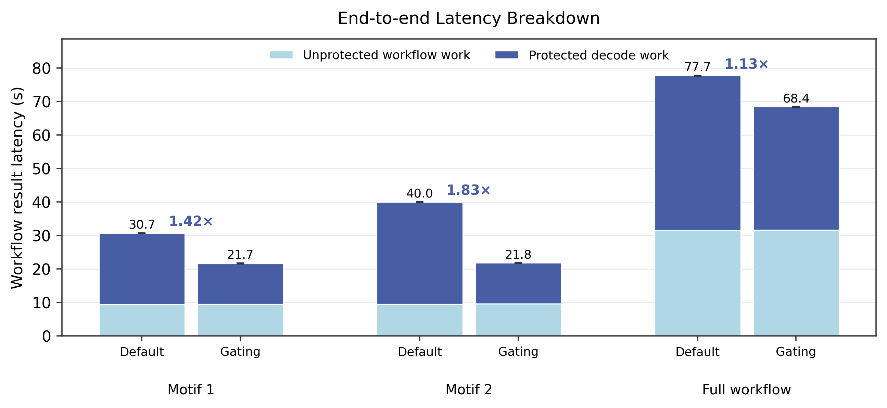
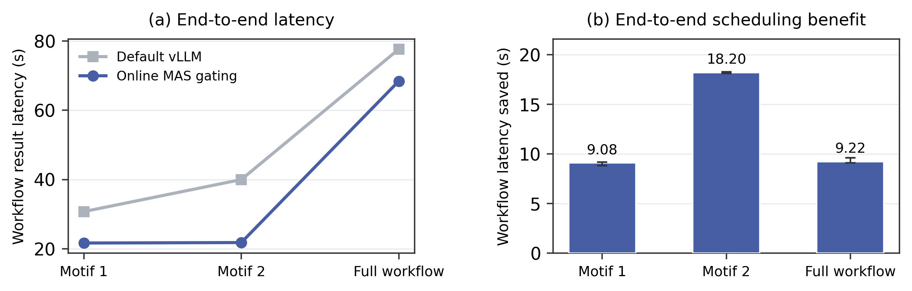

# Case Study 1：Online Graph- and Phase-Aware Admission Gating

## Motivation

MAS workflow 会在单个 top-level task 内产生并发 agent 请求、tool wait 和 tool-return resume。真实 MASBench trace 显示，non-critical agent 的 cold/resume Prefill 会在关键 agent 正在 Decode 时进入同一 vLLM batch，造成 token-level interference，抬高关键 Decode TPOT，并延迟最终 workflow result。

## Design

我们实现了一个位于 vLLM 外部的轻量在线 admission controller。它只使用 request ready 时已经可知的 workflow graph、agent criticality、cold/resume phase、prompt token 数以及当前 critical frontier 状态：关键请求始终立即提交；当关键 frontier 正在 Decode 时，超过 Prefill admission budget 的 non-critical tool-resume 请求被短暂 defer，并在 frontier 结束或达到 maximum defer time 后释放。该策略不读取未来 trace、不预测 output length，也不使用执行结束后的 actual critical path。

实验包含 2-agent motif、4-agent motif 和带三个 eligible interference windows 的完整 `issue_to_verified_patch` workflow。所有结果均来自 MAS 环境中的 Qwen3-8B、单张 RTX A6000、真实 vLLM streaming、实时 Tavily，以及 vLLM scheduler step/batch 粒度 instrumentation。

## Results

| Configuration | Default vLLM | Online gating | E2E speedup | Critical TPOT p95 |
|---|---:|---:|---:|---:|
| 2-agent motif | 30.74 s | 21.66 s | 1.42× | 32.59 → 24.12 ms |
| 4-agent motif | 39.99 s | 21.80 s | 1.83× | 41.25 → 24.12 ms |
| Full workflow | 77.66 s | 68.44 s | 1.13× | 29.11 → 24.56 ms |

Baseline 分别在三个配置中观察到 40.5K、80.3K 和 53.0K 个 tool-resume Prefill tokens 与受保护 Decode 重叠；online gating 将该重叠降为 0，并最终转化为 29.5%、45.5% 和 11.9% 的 workflow latency reduction。这个 case study 建立了 `MAS graph/phase trace → serving interference diagnosis → online graph-aware runtime decision → end-to-end benefit` 的证据链。

## Reproduction and evidence

- `workflow.py`、`admission.py`：真实 workflow 与在线 admission policy。
- `vllm_step_trace.patch`：vLLM scheduler-step instrumentation。
- `artifacts/paper_configs/`：真实 run traces、聚合结果与 PNG/PDF 图片。
- `run_paper_motifs.sh`、`run_paper_full.sh`：正式实验入口。
- `analyze_paper_configs.py`：校验 trace 并重绘论文图片。

原始 Tavily 内容不截断、不使用 synthetic fallback，实验产物不包含 API key。
