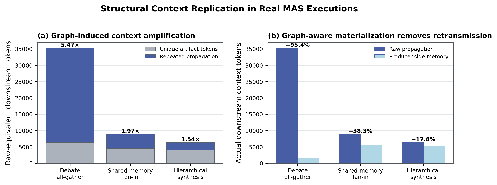
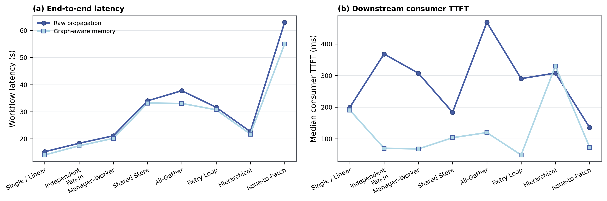

# Case Study 2：Graph-Aware Producer-Side Structured Memory

## Motivation

MAS 的上下文成本不只是单个 prompt 过长。MASBench artifact-level trace 显示，同一信息会沿 fan-out、fan-in、manager–worker 和 multi-round dependency 被多个 agent 重复消费与 Prefill；在真实 Raw executions 中，这种 graph-induced propagation amplification 最高达到 5.47×。

## Design

我们根据 workflow graph 在 producer request ready 时已知的 expected consumer count、fan-in width 和跨 round reuse 判断 artifact 是否值得结构化物化。仅高复用 producer 在原始 generation 末尾同步输出一个 compact structured sidecar；runtime 将其写入 task-scoped JSON store，下游只能依据静态 dependency 检索合法 upstream records。

该设计不启动独立 Memory Agent：否则 memory construction 需要再次读取完整 producer output，额外产生一次 Prefill 和 Decode，容易抵消结构化 memory 的收益。Producer-side materialization 将 answer 与 compact view 放在同一次请求中，并对低复用节点直接 bypass。优化不删除 communication edge，保留 source provenance，并通过 coverage、grounding 和 focus checks 验证结构化记录。

正式实验覆盖 8 类 graph/workflow：Single / Linear、Independent Fan-In、Manager–Worker、Shared Store、All-Gather、Retry Loop、Hierarchical 和完整 Issue-to-Patch。每个 workload/mode 重复 2 次，共 32 个真实 run；全部使用 MAS 环境中的 Qwen3-8B、单张 RTX A6000、真实 vLLM SSE streaming 和实时 Tavily。

## Results

| Workflow | E2E speedup | Consumer TTFT reduction | Downstream context reduction |
|---|---:|---:|---:|
| Independent Fan-In | 1.05× | 81.1% | 94.7% |
| Manager–Worker | 1.05× | 78.1% | 92.5% |
| All-Gather | 1.14× | 74.5% | 95.4% |
| Retry Loop | 1.03× | 83.3% | 92.1% |
| Issue-to-Patch | 1.15× | 46.3% | 90.5% |

Single / Linear 没有 eligible artifact，排除 Tavily wait 后 latency 基本不变，构成负对照；Hierarchical 的 propagation amplification 只有 1.54×，TTFT 未改善，说明收益取决于 graph reuse 强度，而不是对所有 workflow 无条件成立。All-Gather 和完整 Issue-to-Patch 分别获得 1.14× 与 1.15× observed E2E speedup，建立了 `graph communication → repeated context Prefill → MASBench trace diagnosis → selective producer-side materialization` 的证据链。

## Reproduction and evidence

- `workflow.py`：8 类真实 workflow、graph eligibility、same-generation sidecar 与 trace。
- `memory.py`：task-scoped append-only store 和 dependency-safe retrieval。
- `results/runs/`：32 个正式 run 的 config、trace、Tavily snapshot、summary 和 frozen memory。
- `tables/`：逐 run 与 median/min/max 聚合结果。
- `figures/`：两张论文图片的 PNG/PDF 版本。
- `validate_results.py`：真实 SSE/Tavily、无第二 memory LLM、coverage/grounding 检查。

实验不使用 synthetic/recorded tool result，所有产物均不包含 Tavily API key。
