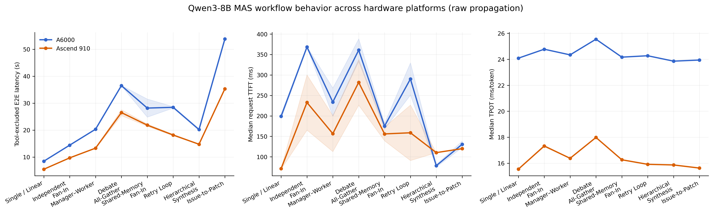
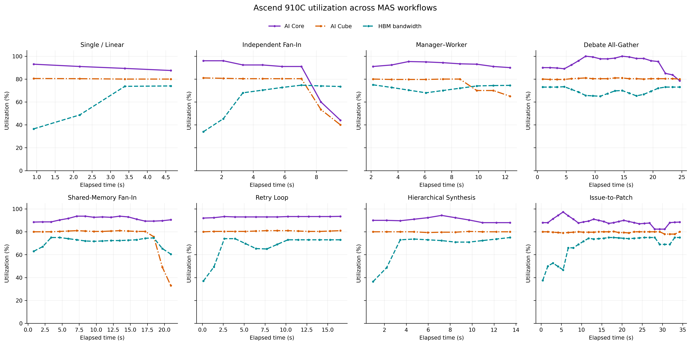
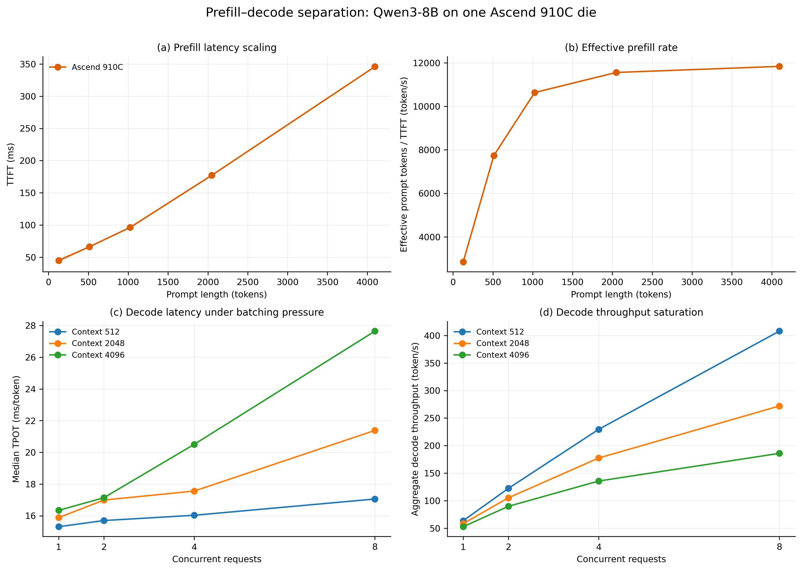
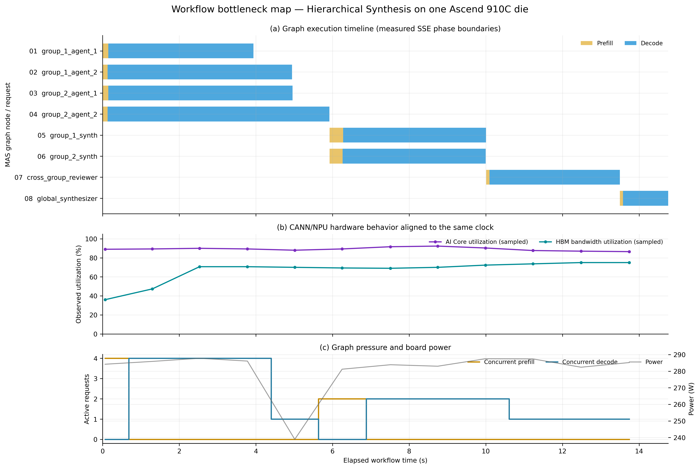

# Cross-hardware MASBench profiling

本目录集中保存 MASBench-Arch 的跨硬件适配、实验配置、采集结果和可视化。目前包含单张 RTX A6000 与单张 Ascend 910 上的 Qwen3-8B 初步对比。

## 目录

```text
cross_hw/
├── configs/                         # Ascend/Qwen3-8B 实验配置
├── figures/                         # A6000 与 Ascend 的 PNG/PDF 对比图
├── results/                         # CSV、manifest、实验说明和 trace 归档
├── scripts/
│   ├── start_vllm_qwen3_ascend.sh   # vLLM Ascend 服务启动
│   ├── run_ascend_hardware_profile.sh
│   └── plot_hardware_profile.py
├── workflow.py                      # 支持冻结 Tavily evidence 的真实 SSE workflow
└── raw_runs/                        # 服务器本地展开结果，默认不进入 Git
```

## 已完成实验

- 模型：Qwen3-8B
- 平台：RTX A6000、Ascend 910
- 模式：raw context propagation
- Workload：Single/Linear、Independent Fan-In、Manager–Worker、Debate All-Gather、Shared-Memory Fan-In、Retry Loop、Hierarchical Synthesis、Issue-to-Patch
- 重复：每个平台、每种 workload 各 2 次
- 请求指标：input/output tokens、TTFT、TPOT、request latency
- Workflow 指标：tool-excluded E2E latency、graph amplification

新增的底层行为实验不把 prefill/decode microbenchmark 当作最终研究对象，
而是用它标定 serving stack，再把硬件采样对齐回真实 MAS graph 的节点时间线：

- Prefill sweep：prompt length 128--4096，观察 TTFT 与有效 prefill rate。
- Decode sweep：context 512/2048/4096 × concurrency 1/2/4/8，观察 TPOT 与总吞吐饱和。
- Workflow bottleneck map：在相同秒级时间轴上叠加 graph node 的 prefill/decode Gantt、
  AI Core/HBM 利用率、活动请求压力和功耗。



当前底层行为主图采用 NPU-only small multiples：每个 MAS workflow 一个子图，
在真实 elapsed-time 横轴上对齐 AI Core、AI Cube 与 HBM bandwidth utilization。
每个 workflow 已完成 3 次 telemetry run，图中选择中位耗时 run 保持可读性，
全部 run 的统计保存在 CSV 中。



Prefill/decode sweep 作为 serving-stack 标定图保留，建议在论文中放入附录：





## Ascend 服务启动

```bash
cd /root/MASBench-for-Arch
nohup ./cross_hw/scripts/start_vllm_qwen3_ascend.sh \
  > logs/vllm_ascend_launcher.out 2>&1 < /dev/null &
```

默认模型路径为 `/model/Qwen3-8B`，服务地址为 `http://127.0.0.1:8000/v1`，模型服务名为 `local-mas-model`。

## 采集 Ascend traces

```bash
cd /root/MASBench-for-Arch
REPEATS=2 ./cross_hw/scripts/run_ascend_hardware_profile.sh
```

展开后的 runs 写入 `cross_hw/raw_runs/`。用于论文和跨平台汇总的压缩 trace、CSV 和 manifest 位于 `cross_hw/results/`。

## 重新绘图

`scripts/plot_hardware_profile.py` 接受 A6000 和 Ascend 两个解压后的 trace 根目录，并同时输出 PNG、PDF、逐 run CSV 和逐 request CSV。当前已生成：

- `fig1_hardware_workflow_overview`
- `fig2_ttft_request_progression`
- `fig3_tpot_request_progression`
- `fig4_graph_amplification`

底层行为实验入口：

```bash
python cross_hw/scripts/run_prefill_decode_sweep.py \
  --output cross_hw/raw_runs/ascend_prefill_decode --repeats 2

REPEATS=1 PROFILE_ID=ascend_workflow_timeline \
  ./cross_hw/scripts/run_workflow_bottleneck_profile.sh
```

绘图脚本 `scripts/plot_bottleneck_profile.py` 生成：

- `fig5_prefill_decode_characterization`
- `fig6_workflow_bottleneck_map`
- `fig7_ascend_workflow_utilization`
- `workflow_phase_hardware_summary.csv`

NPU-only workflow utilization 图由
`scripts/plot_ascend_workflow_utilization.py` 生成；脚本可同时接受多个
`--profile-root`，并自动选择每种 workflow 的中位耗时代表 run。

详细实验定义、首轮数值和采样限制见
[`results/bottleneck_experiment_notes.md`](results/bottleneck_experiment_notes.md)。

## 结果解释边界

当前结果适合用于确认图形设计和形成初步观察，但仍属于硬件与 serving stack 的组合比较。论文定稿前建议增加到至少 5 次重复，记录并统一 vLLM/插件版本及服务参数，并增加并发 workflow sweep。

当前 `npu-smi` 单次采样接近 1 秒，短 prefill 区间可能没有落入硬件采样点。
图中的 graph/SSE phase boundary 仍为精确时间戳，但 prefill 瓶颈定论需在后续加入
CANN/msprof kernel counter，并在 A6000 侧使用匹配的 Nsight/DCGM collector。
