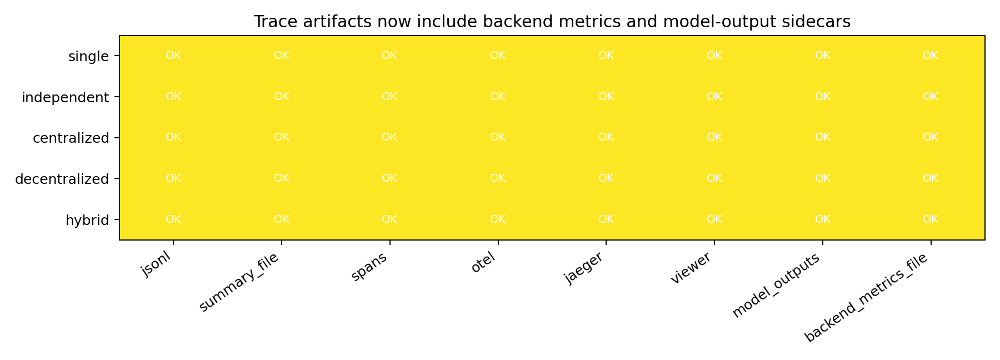
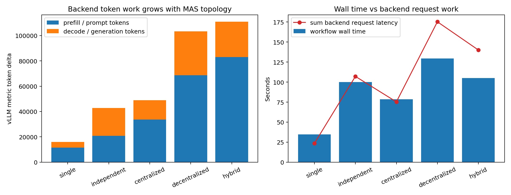
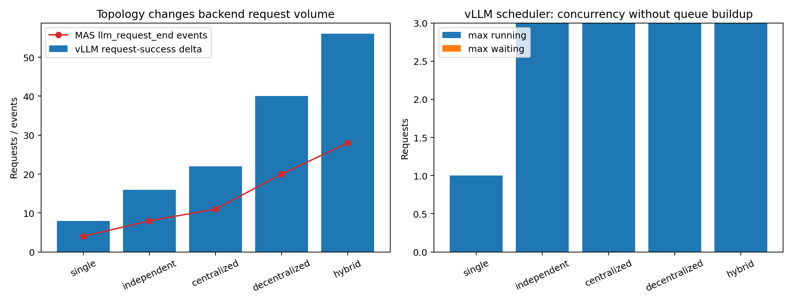
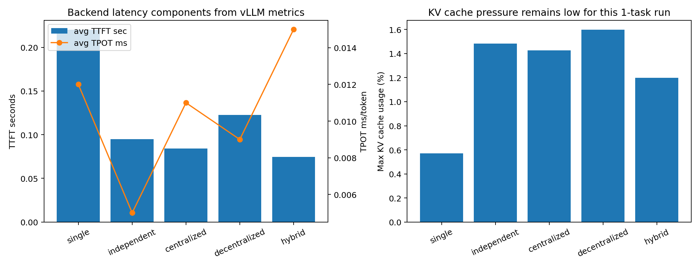
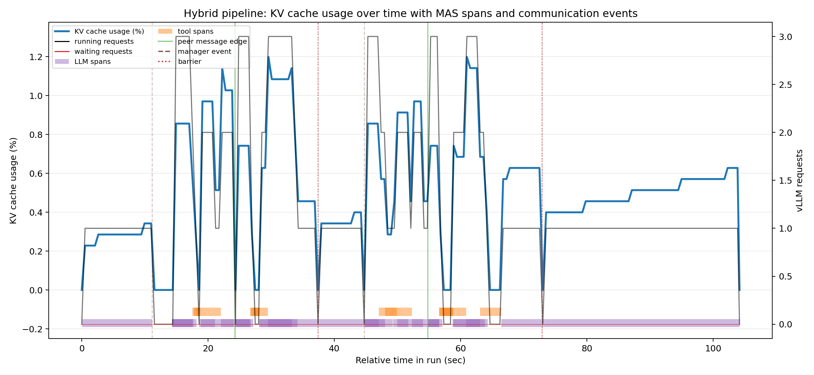
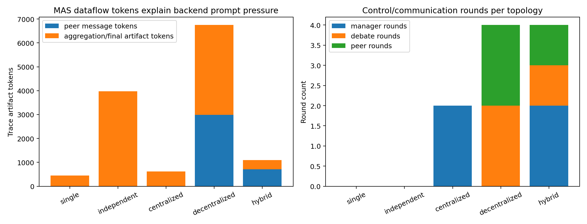
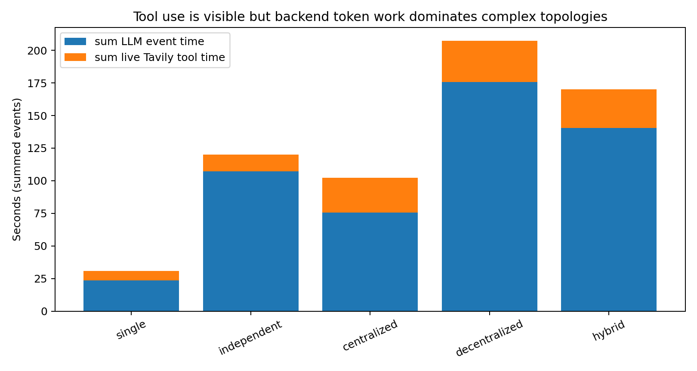

# Week 1 Progress: 基础 MAS 拓扑与 vLLM Backend Metrics 验证

## 1. 本周目标

本轮重新生成 Week 1 阶段性报告，重点不是继续美化原来的 workflow-level 图，而是把 vLLM `/metrics` 接入 MAS trace，重新跑真实 backend trace，并用 backend token、request、scheduler、TTFT/TPOT、KV cache 指标支撑 insight。

本轮仍然没有新增 meso workflow，没有设计 full workflow，也没有修改 vLLM scheduler/KV manager。vLLM 只作为 OpenAI-compatible backend 运行，MAS 侧通过 Prometheus `/metrics` 做窗口级采样。

## 2. Trace Inventory

本轮删除了旧 `mas_workflow/traces` 和旧 `progress/week1`，重新跑了 5 条真实 SWE-bench Lite trace。任务实例均为 `astropy__astropy-12907`。

| topology | instance_id | run_id | JSONL | backend metrics | metric samples | model outputs | model output records |
| --- | --- | --- | --- | --- | --- | --- | --- |
| single | astropy__astropy-12907 | 20260518_214631_753380 | yes | yes | 67 | yes | 4 |
| independent | astropy__astropy-12907 | 20260518_214718_766802 | yes | yes | 190 | yes | 8 |
| centralized | astropy__astropy-12907 | 20260518_214911_852572 | yes | yes | 150 | yes | 11 |
| decentralized | astropy__astropy-12907 | 20260518_215041_675435 | yes | yes | 247 | yes | 20 |
| hybrid | astropy__astropy-12907 | 20260518_215305_746547 | yes | yes | 200 | yes | 28 |

每个 run 同目录包含：`.jsonl`、`_summary.json`、`_spans.json`、`_otel.json`、`_jaeger.json`、`_viewer.html`、`_backend_metrics.json`、`_model_outputs.json`。

## 3. 验证设置

- vLLM server: `Qwen3.5-4B`, `CUDA_VISIBLE_DEVICES=0`, `--gpu-memory-utilization 0.80`, `--max-model-len 32768`。
- 启动时可用 KV cache: 日志显示约 `231,264` tokens，最大 32,768-token request concurrency 约 `25.42x`。
- MAS config: `--llm-mode openai_compatible`, `--agent-execution react`, `--tool-mode live`, `--search-provider tavily`, `--max-output-tokens 4096`。
- Trace config: `--collect-backend-metrics true`, `--record-model-outputs true`, `--trace-level detailed`, `--latency-profile none`。
- 本轮真实运行使用 Tavily live search，没有注入 synthetic latency。

## 4. Trace Schema 与 Backend Metrics 接入

本轮新增 `_backend_metrics.json` sidecar。它按 0.5s 采样 vLLM `/metrics`，并在 `_summary.json` 中写入窗口级 delta：`prompt_tokens_total_delta`、`generation_tokens_total_delta`、`request_success_total_delta`、`e2e_request_latency_seconds_sum_delta`、`backend_avg_ttft_sec_from_metrics`、`backend_avg_tpot_sec_from_metrics`、`max_num_requests_running`、`max_num_requests_waiting`、`max_gpu_cache_usage_perc`。

注意：这些是 Prometheus window-level metrics，不是逐 request prefill/decode trace。它足以说明 topology 对 backend workload 的宏观压力，但还不能替代 vLLM 内部 per-request scheduler/KV trace。

## 5. Backend Metrics 总表

| topology | wall latency s | prompt token delta | generation token delta | request delta | max running | max waiting | max KV cache % | avg TTFT s | avg TPOT s |
| --- | --- | --- | --- | --- | --- | --- | --- | --- | --- |
| single | 34.71 | 11456 | 4584 | 8.0 | 1.0 | 0.0 | 0.571 | 0.220101 | 1.2e-05 |
| independent | 99.98 | 20820 | 21981 | 16.0 | 3.0 | 0.0 | 1.483 | 0.094785 | 5e-06 |
| centralized | 78.6 | 33604 | 15297 | 22.0 | 3.0 | 0.0 | 1.426 | 0.084356 | 1.1e-05 |
| decentralized | 129.51 | 68726 | 34689 | 40.0 | 3.0 | 0.0 | 1.597 | 0.122446 | 9e-06 |
| hybrid | 104.9 | 83048 | 27864 | 56.0 | 3.0 | 0.0 | 1.198 | 0.074527 | 1.5e-05 |

## 6. 阶段性 Insights

### Insight 1: 统一 trace 已覆盖 MAS 层和 backend metrics sidecar

现象：五个 topology 都同时产出 MAS canonical JSONL、可视化导出、模型输出 sidecar 和 vLLM metrics sidecar。

证据：每个 topology 都有 `_backend_metrics.json`，采样数从 `67` 到 `247` 不等；每次 LLM response 也进入 `_model_outputs.json`。

解释：当前 trace 已经能把 MAS topology 结构和 backend serving 窗口指标放到同一个 run 目录下，适合做 topology-level system analysis。

下一步：如果要做更强 request-level 结论，需要在 vLLM 侧输出 per-request prefill/decode/KV/scheduler event，并通过 `X-Request-Id` 对齐。

### Insight 2: MAS topology 会显著放大 backend token work

现象：复杂 topology 对 vLLM 后端造成的 token work 明显高于 single baseline。

证据：single 的 prompt token delta 为 `11456`，decentralized 为 `68726`，hybrid 为 `83048`。hybrid 相比 single 的 prompt-token work 放大约 `7.25x`，decentralized 相比 single 放大约 `6.00x`。

解释：这不是单纯 wall-clock 变慢，而是 backend 实际处理的 prefill/prompt tokens 变多。Debate 和 hybrid 的 peer messages、manager instructions、聚合上下文都会转化为后端 prompt workload。

下一步：后续 meso workflow 应该把 prompt/context growth 作为一等优化目标，而不是只看 agent 数量。

### Insight 3: 当前 4B 单卡服务没有明显 scheduler queue buildup，瓶颈更像 workload amplification

现象：多 agent topology 能把 `max_num_requests_running` 提到 3，但 `max_num_requests_waiting` 仍为 0。

证据：independent/centralized/decentralized/hybrid 的 `max_num_requests_running=3`，而五个 topology 的 `max_num_requests_waiting=0`。

解释：在本轮 4B 模型、单任务、3-agent 并发下，vLLM capacity 足够，没有形成 scheduler waiting queue。因此现阶段的主要证据不是“排队瓶颈”，而是 topology 造成的 request/token work amplification。这个结论比原先 workflow-only 图更强，因为它来自 backend scheduler metrics。

补充：这条观察也暴露了旧 centralized/hybrid 原型的局限：上层 topology 激活宽度固定，导致 `max running` 很容易被写死的 agent 数量限制。当前代码已经把 centralized/hybrid 改成 dynamic orchestrator：manager 从更大的 specialist pool 中选择本轮实际调用的 subagents，并记录 `available_agent_count`、`selected_agent_count`、`selected_agent_roles`、`dynamic_fanout_count`。因此后续真实 backend trace 可以区分“候选 pool 大小”和“实际激活宽度”。

下一步：如果要观察 scheduler contention，需要增加并发任务数、agent 数、round 数或降低 serving capacity，而不是只换图表。

### Insight 4: TTFT/TPOT 和 KV cache 指标说明本轮还没有压到 KV/cache 瓶颈

现象：TTFT/TPOT 可采集，KV cache usage 峰值很低。新增的 pipeline 曲线把 hybrid run 的 KV cache usage 时间序列与 MAS-level LLM spans、tool spans、peer communication edge、manager decision/barrier event 叠加在一张图里。

证据：本轮最大 KV cache usage 最高约 `1.597%`。在 pipeline 曲线中，KV usage 只在 LLM 活跃 span 附近轻微上升，并没有随 peer communication 或 manager collect 出现明显堆积；同时 `max_num_requests_waiting=0`。TTFT 在不同 topology 间变化，但 KV/cache 还没有成为主要压力源。

解释：虽然 max model len 和 KV cache capacity 很大，但单个 SWE-bench instance 的实际上下文还远远没有压满 KV cache。此前只看 `max_gpu_cache_usage_perc` 单个标量太单薄；现在的动态曲线更清楚地说明：metrics path 已经接通，但本轮 workload 还没有触发持续 KV pressure。

下一步：要研究 KV/cache，应该构造长上下文、多轮 debate、多实例并发，或者接入 vLLM 细粒度 KV block metrics。尤其需要用 dynamic orchestrator 放大真实激活宽度，而不是固定 3 个 agent。

### Insight 5: Hybrid/Decentralized 的开销来自 control/dataflow 嵌套，而不仅是 agent 数

现象：hybrid 和 decentralized 的 backend prompt token delta 高，和 peer/message/round 结构一致。

证据：decentralized 的 `debate_rounds_actual=2`，hybrid 的 `manager_rounds_actual=2`、`peer_rounds_actual=1`，hybrid 的 `peer_message_tokens_est=710`。这些 MAS 层 dataflow 指标和 backend prompt token 增长方向一致。

解释：hybrid 同时叠加 manager 控制路径和 peer communication；decentralized 没有 manager，但 all-gather/debate context 会膨胀。backend metrics 把这种结构性开销转化成更直观的 token work 证据。

下一步：设计 meso workflow 时应重点控制 peer communication 范围、manager round 次数和 aggregation 输入规模。

### Insight 6: Tool use 可见，但本轮复杂 topology 的主要压力仍在 LLM/backend token work

| topology | tool_search events | sum Tavily tool time s | snapshot count |
| --- | --- | --- | --- |
| single | 2 | 7.44 | 2 |
| independent | 3 | 12.6 | 3 |
| centralized | 5 | 26.62 | 5 |
| decentralized | 9 | 31.59 | 9 |
| hybrid | 13 | 29.58 | 13 |

现象：每个 topology 都有真实 Tavily tool use 和 snapshot，但复杂 topology 的 backend request/token work 增长更显著。

证据：所有 run 都生成了 `tool_search` event 和 snapshot；同时 backend prompt/generation token delta 随 topology 复杂度显著上升。

解释：工具调用时间是真实外部 stall，但本轮真正能解释 topology 差异的是 LLM request 数、prompt token、generation token 和 round/dataflow 结构。

下一步：后续要分别研究 tool-stall dominated workload 和 LLM-serving dominated workload。

## 7. SWE-bench Lite Trace Collection

本轮每个 topology 重新采集 1 条 SWE-bench Lite trace，均为 `astropy__astropy-12907`。当前仍不评估修复成功率，只采集 execution trace、tool snapshot、model outputs 和 backend metrics。

`mas_workflow/traces/summary_week1_backend_metrics.json` 保存了本轮汇总。

## 8. 当前结论

- vLLM backend metrics 已接入 MAS trace，并写入每个 run 的 `_backend_metrics.json` 和 `_summary.json`。
- 新 trace 比原 trace 更有说服力：能直接看到 topology 对 backend prompt/generation tokens、request volume、running/waiting requests、TTFT/TPOT、KV cache usage 的影响。
- 本轮最强证据是 work amplification：hybrid/decentralized 显著增加 backend prompt token work。
- 本轮没有观察到 scheduler queue buildup，也没有观察到 KV/cache 压力；这不是失败，而是说明当前 workload 还不够压迫 serving 系统。
- 旧 trace 中 `max running=3` 主要反映固定激活宽度；当前代码已经将 centralized/hybrid 改为 dynamic orchestrator，从候选 agent pool 中按轮选择不同 subagents，后续 backend run 应以该版本重新采集。

## 9. 当前问题与风险

- `/metrics` 是窗口级 aggregate，不是 per-request prefill/decode/KV/scheduler trace。
- `request_success_total_delta` 是 vLLM metrics 窗口计数，和 MAS `llm_request_end` event 数不一定一一相等；强 per-request 对齐仍需要 vLLM 侧 request trace。
- 本轮只有一个 SWE-bench instance，结论是阶段性系统观察，不是统计结论。
- dynamic orchestrator 已通过 mock/synthetic smoke test 验证，但本报告表格中的 vLLM backend 数值来自上一轮真实 backend trace，尚未全量重跑 dynamic orchestrator backend trace。
- live search 依赖 Tavily API key。
- full workflow 尚未定义，case study 尚未开始。
- 没有修改 vLLM scheduler/KV manager。

## 10. 下一步计划

- 构造能触发 scheduler queue 的 workload：提高并发实例数、agent 数、round 数，或降低 serving capacity。
- 用 dynamic orchestrator 版本重跑 centralized/hybrid backend trace，观察实际激活宽度、候选 pool 大小、scheduler running/waiting 和 token work 的关系。
- 构造长上下文 debate/hybrid workload，观察 KV cache usage 是否上升，并继续使用 pipeline 曲线叠加 spans/communication/barrier。
- 在 vLLM fork 中增加 per-request prefill/decode/KV/scheduler event，并用 `X-Request-Id` 对齐 MAS trace。
- 基于当前 observation 设计 2-3 个 meso workflow。
