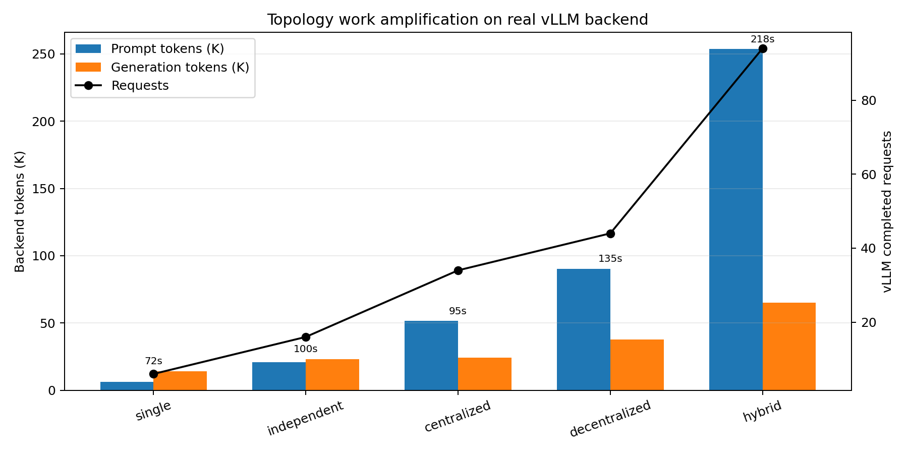
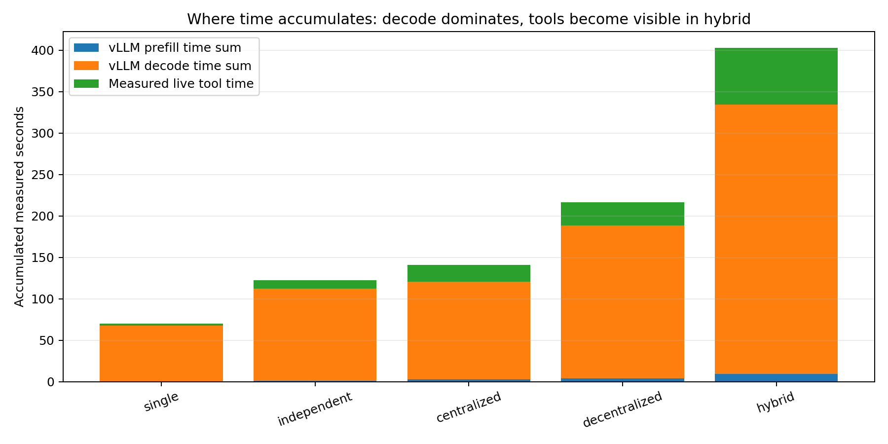
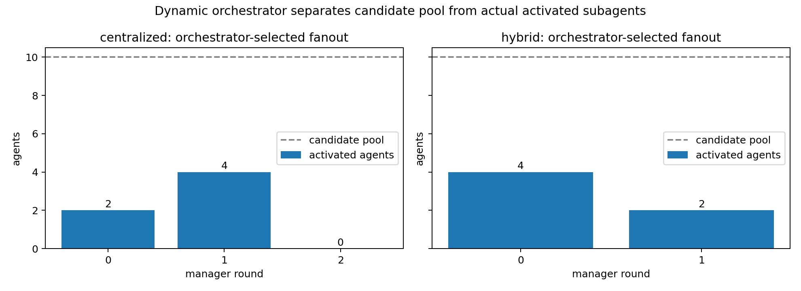
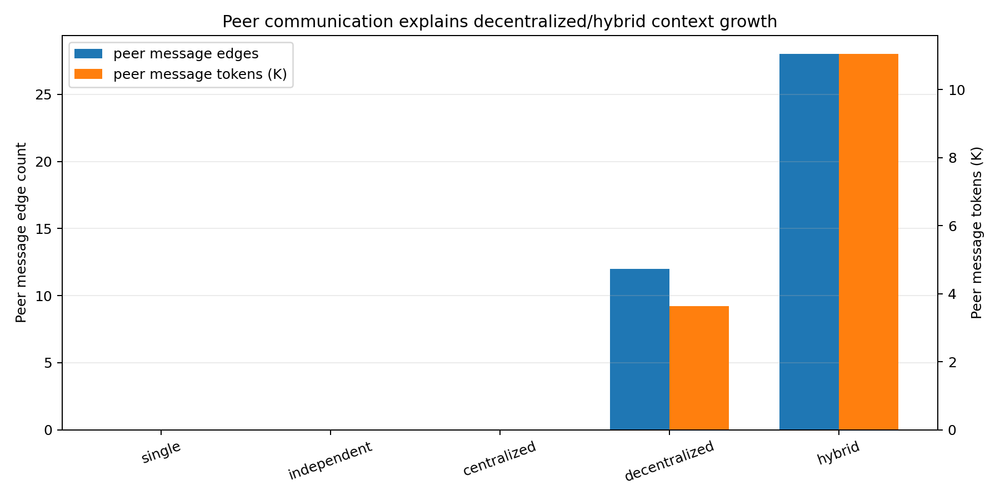
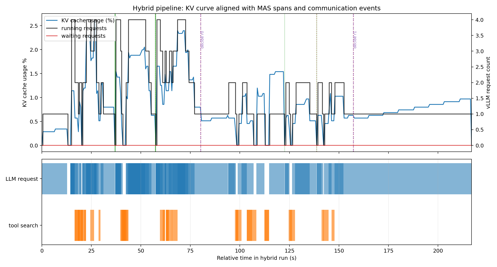
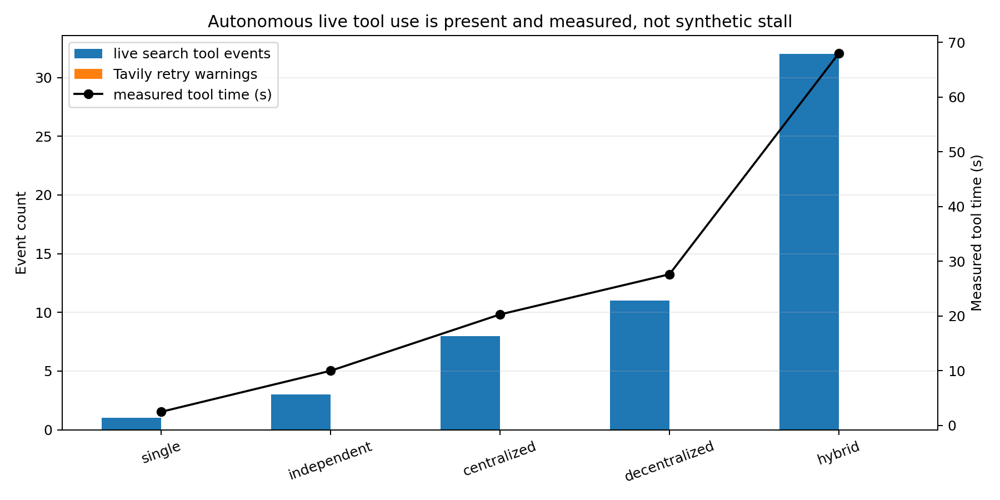

# Week 1 Progress: Dynamic Orchestrator + vLLM Trace Evidence

## 1. 本轮目标

本轮替换旧的 Week 1 汇报内容，使用最新 dynamic orchestrator 逻辑重新采集真实 trace，并生成可以直接用于汇报的系统侧 insight。

本轮没有新增 meso workflow，没有设计 full workflow，也没有修改 vLLM scheduler/KV manager。所有结论都来自同一个 SWE-bench Lite 实例 `astropy__astropy-12907`，使用本地 vLLM OpenAI-compatible backend、LangGraph ReAct agent、Tavily live search、模型输出 sidecar 和 vLLM `/metrics` sidecar。

旧的 trace schema 总览图已删除。本报告不再把“字段存在”作为主要 insight，而是聚焦真实 backend work amplification、dynamic fanout、tool time、peer communication 和 KV/cache time series。

## 2. Trace Collection Setup

运行环境：

- vLLM backend: `local-mas-model`, Qwen3.5-4B, `http://127.0.0.1:8000/v1`
- `--llm-mode openai_compatible`
- `--agent-execution react`
- `--tool-mode live`
- `--search-provider tavily`
- `--max-output-tokens 4096`
- `--collect-backend-metrics true`
- `--record-model-outputs true`
- `--trace-level detailed`
- `--latency-profile none`
- centralized/hybrid: `--agent-pool-size 10 --max-selected-agents 4`

说明：

- `datasets` 包未安装，因此 SWE-bench Lite metadata 通过 Hugging Face rows API 读取；任务仍是真实 `astropy__astropy-12907`。
- 第一次 hybrid 运行中 Tavily 出现一次 HTTPS connection reset，未把半截 trace 计入结果。随后给 Tavily provider 增加有限重试，清理 hybrid partial trace 后重新运行成功。重试不会伪造结果，也不会注入人工延迟；成功 run 中没有 retry warning。
- 本轮所有 tool time 都来自 live Tavily measured duration，`latency_profile=none`。

## 3. Trace Inventory

| topology | run_id | wall s | JSONL | summary | viewer | backend metrics | model outputs |
|---|---:|---:|---|---|---|---|---|
| single | `20260520_185908_021014` | 72.2 | yes | yes | yes | yes | yes |
| independent | `20260520_190023_893436` | 100.0 | yes | yes | yes | yes | yes |
| centralized | `20260520_190205_926854` | 95.4 | yes | yes | yes | yes | yes |
| decentralized | `20260520_190344_677199` | 134.9 | yes | yes | yes | yes | yes |
| hybrid | `20260520_191025_651195` | 218.0 | yes | yes | yes | yes | yes |

Trace 路径：

- `mas_workflow/traces/<topology>/astropy__astropy-12907/<run_id>.jsonl`
- `mas_workflow/traces/<topology>/astropy__astropy-12907/<run_id>_summary.json`
- `mas_workflow/traces/<topology>/astropy__astropy-12907/<run_id>_backend_metrics.json`
- `mas_workflow/traces/<topology>/astropy__astropy-12907/<run_id>_model_outputs.json`
- `mas_workflow/traces/<topology>/astropy__astropy-12907/<run_id>_viewer.html`

## 4. Summary Table

| topology | prompt tokens | generation tokens | requests | LLM events | tool events | tool time s | peer edges | peer tokens | max running | max waiting | max KV % |
|---|---:|---:|---:|---:|---:|---:|---:|---:|---:|---:|---:|
| single | 6,314 | 14,163 | 6 | 3 | 1 | 2.50 | 0 | 0 | 1 | 0 | 0.0068 |
| independent | 20,696 | 23,139 | 16 | 8 | 3 | 10.00 | 0 | 0 | 3 | 0 | 0.0154 |
| centralized | 51,448 | 24,081 | 34 | 17 | 8 | 20.29 | 0 | 0 | 4 | 0 | 0.0200 |
| decentralized | 90,324 | 37,563 | 44 | 22 | 11 | 27.63 | 12 | 3,644 | 3 | 0 | 0.0171 |
| hybrid | 253,552 | 65,010 | 94 | 47 | 32 | 68.01 | 28 | 11,047 | 4 | 0 | 0.0262 |

## 5. Insight 1: Topology Choice Directly Amplifies Backend Work

现象：不同 MAS topology 对 vLLM backend 的 token work 和 request volume 放大非常明显。

证据：

- single prompt tokens: `6,314`
- decentralized prompt tokens: `90,324`, 是 single 的 `14.3x`
- hybrid prompt tokens: `253,552`, 是 single 的 `40.2x`
- hybrid completed requests: `94`, 是 single 的 `15.7x`
- hybrid wall time: `218.0s`, 是 single 的 `3.0x`

解释：wall time 没有按 prompt tokens 线性增长，因为 worker/peer 阶段存在并发，且 vLLM 没有形成 waiting queue。但 backend 确实处理了多得多的 prompt/generation tokens 和 requests。对 architecture 研究而言，这比单看 workflow graph 更有价值：它说明 topology 会把 MAS 层的通信、聚合和 ReAct tool loop 转化为 serving backend 的实际 workload。

## 6. Insight 2: 当前耗时主要来自 Decode，Tool Time 在 Hybrid 中变得可见

现象：在本轮真实 backend trace 中，decode accumulated time 是主要 LLM 侧耗时；live tool time 在 hybrid 中已经不可忽略。

证据：

- hybrid vLLM prefill time sum: `9.30s`
- hybrid vLLM decode time sum: `325.32s`
- hybrid live tool measured time: `68.01s`
- decentralized decode time sum: `184.86s`
- single decode time sum: `67.23s`

解释：当前 workload 的输出较长，且 `max-output-tokens=4096`，所以 decode 成本是主要 backend 时间来源。Tool time 不是人工 stall：hybrid 有 `32` 个 live search tool events，累计 `68.01s` measured time。后续如果要区分 prefill-bound vs decode-bound MAS workload，需要同时控制 prompt context growth 和 per-agent output length。

## 7. Insight 3: Dynamic Orchestrator 已经解除固定 Fanout 限制

现象：centralized 和 hybrid 不再固定激活 `num_agents` 个下游 worker，而是在 10 个候选 specialist pool 中按 manager round 选择实际 subagents。

证据：

- centralized candidate pool: `10`
- centralized actual fanout by round: `[2, 4, 0]`
- centralized selected roles:
  - round 0: `issue_triage`, `repo_search`
  - round 1: `code_localization`, `api_doc`, `test_reasoning`, `judge`
  - round 2: `finish`, no worker fanout
- hybrid candidate pool: `10`
- hybrid actual fanout by round: `[4, 2]`
- hybrid selected roles:
  - round 0: `issue_triage`, `repo_search`, `code_localization`, `tool_heavy`
  - round 1: `test_reasoning`, `patch_planning`

解释：旧 trace 中 `max running=3` 很大程度来自上层固定激活宽度。新逻辑把“候选 pool 大小”和“实际激活宽度”分开记录：`available_agent_count`、`selected_agent_count`、`selected_agent_roles`、`not_selected_agents`、`dynamic_fanout_count`。这让后续研究可以观察 orchestrator policy 如何影响 backend 并发、tool pressure 和 token work。

## 8. Insight 4: Peer Communication 是 Context Growth 的直接来源

现象：没有 peer communication 的 topology 不产生 peer edge tokens；decentralized/hybrid 的 peer rounds 直接带来 message passing 和 context growth。

证据：

- decentralized peer edges: `12`
- decentralized peer tokens: `3,644`
- hybrid peer edges: `28`
- hybrid peer tokens: `11,047`
- hybrid prompt token delta: `253,552`

解释：decentralized 的 all-to-all debate 和 hybrid 的 manager-selected peer discussion 都会把 peer messages 带回下一轮 prompt。Hybrid 的 peer tokens 更高，是因为它同时包含 manager instruction、selected worker evidence、peer rounds 和 manager collection。后续 meso workflow 如果需要可控系统负载，必须把 peer communication topology 和 peer round count 作为一等参数，而不是只调 agent 数。

## 9. Insight 5: KV Cache 当前仍不是瓶颈，但动态曲线说明了原因

现象：hybrid 是本轮最重的 topology，但 KV cache usage 仍然很低，且没有 waiting requests。

证据：

- hybrid max KV cache usage: `0.0262%`
- hybrid max running requests: `4`
- hybrid max waiting requests: `0`
- hybrid prompt tokens: `253,552`
- hybrid requests: `94`

解释：图中 KV 曲线与 LLM spans、tool spans、peer message events、manager decision/barrier event 对齐。可以看到请求密集阶段和 peer communication 阶段确实拉高了 backend activity，但没有形成持续 KV pressure 或 scheduler queue。当前 bottleneck 更像是 decode/token work amplification 和 tool/LLM pipeline length，而不是 KV capacity。要研究 KV/cache，需要构造更长上下文、多实例并发、更多 simultaneous active agents，或在 vLLM fork 中接入 per-request KV block trace。

## 10. Search / Tool Use Validation

本轮使用 LangGraph ReAct agent，工具调用由模型在 agent loop 内自主触发，不是固定 workflow 强行 search。所有成功 trace 中的 search 都是 Tavily live search：

| topology | live search events | measured tool time s | retry warnings |
|---|---:|---:|---:|
| single | 1 | 2.50 | 0 |
| independent | 3 | 10.00 | 0 |
| centralized | 8 | 20.29 | 0 |
| decentralized | 11 | 27.63 | 0 |
| hybrid | 32 | 68.01 | 0 |

本轮没有使用 synthetic latency，也没有 replay 工具结果。工具结果 snapshots 存在于 `mas_workflow/traces/snapshots/<run_id>/`，可用于后续 replay。

## 11. 当前结论

- 新 dynamic orchestrator trace 比旧 trace 更适合汇报：它把固定 fanout 限制拆成了 candidate pool 和实际激活宽度。
- 真实 vLLM metrics 显示 topology 会显著放大 backend token work 和 request volume。
- Hybrid 是当前最重 topology：prompt tokens `253,552`、requests `94`、live tool time `68.01s`、peer tokens `11,047`。
- 当前没有观察到 vLLM waiting queue，也没有观察到 KV cache pressure；这不是“没有瓶颈”，而是说明瓶颈主要在 decode/token work、tool/LLM pipeline length 和 MAS dataflow amplification。
- Tool use 已经是真实 Tavily live search，并由 ReAct agent 自主触发。

## 12. Limitations

- 本轮只跑了一个 SWE-bench Lite instance，因此结论是阶段性系统观察，不是统计结论。
- vLLM `/metrics` 是窗口级采样，不是 per-request prefill/decode/KV/scheduler event。
- KV 图来自 Prometheus sampling，可以说明趋势和低压力状态，但不能替代 KV block-level trace。
- Tavily live search 依赖外部网络；本轮增加了有限重试以处理临时 connection reset。
- 当前仍不评估 SWE-bench 修复成功率。
- full workflow 和 case study 尚未定义。

## 13. 下一步

- 用 dynamic orchestrator 构造更强 stress run：更多同时实例、更大 `max_selected_agents`、更多 peer rounds。
- 设计 2-3 个 meso workflow，分别覆盖 control bottleneck、peer communication bottleneck 和 tool-heavy bottleneck。
- 对接 vLLM per-request trace，按 `X-Request-Id` 记录 prefill/decode/scheduler/KV block 事件。
- 构造长上下文 hybrid/debate workload，专门观察 KV cache pressure 是否出现。
