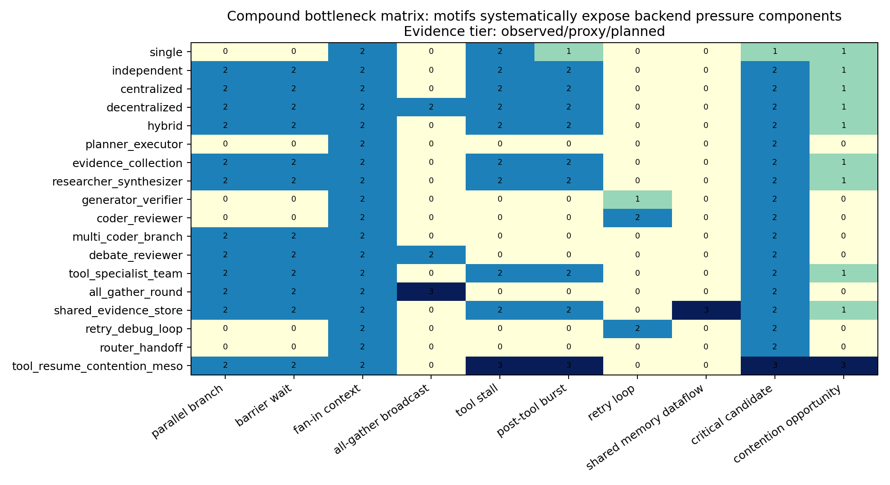
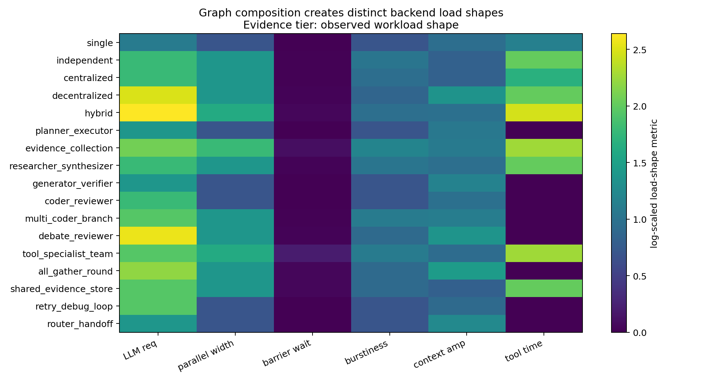
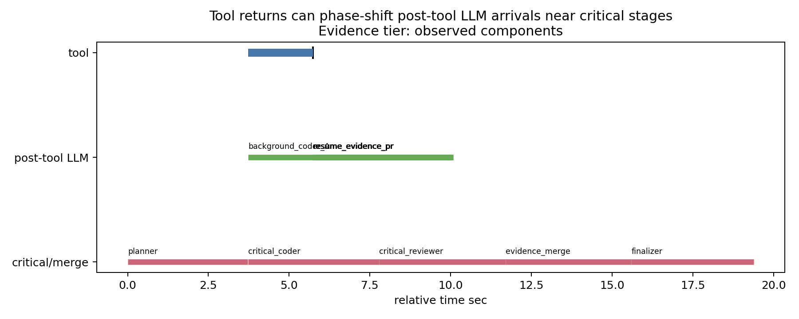
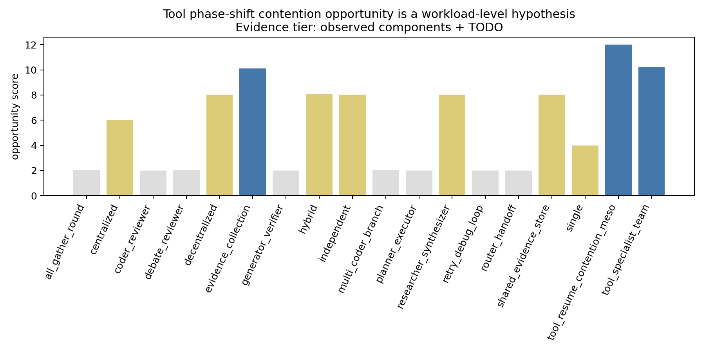
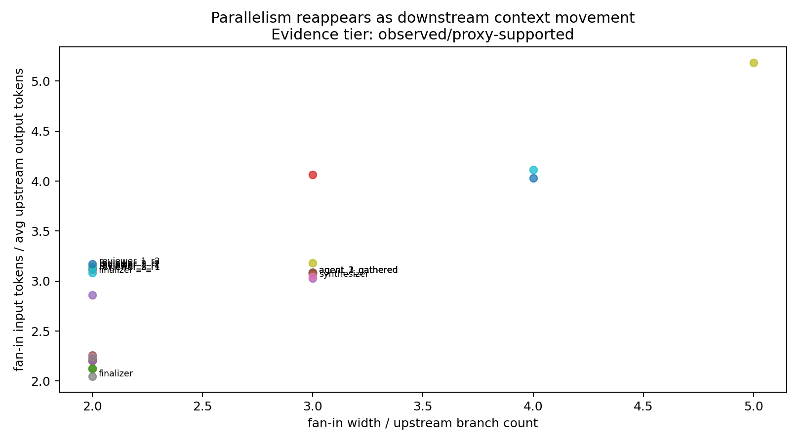
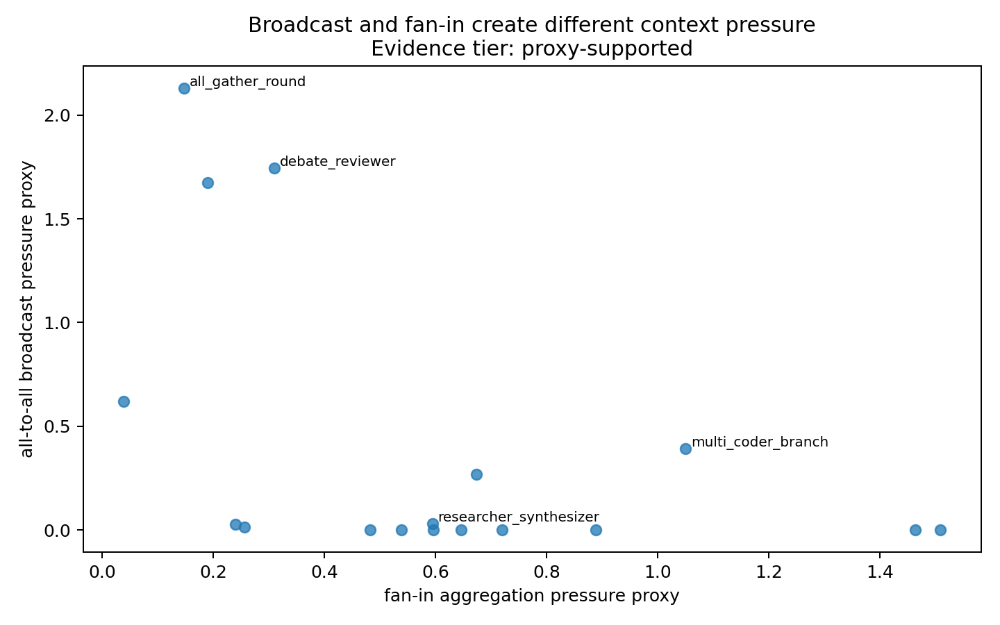
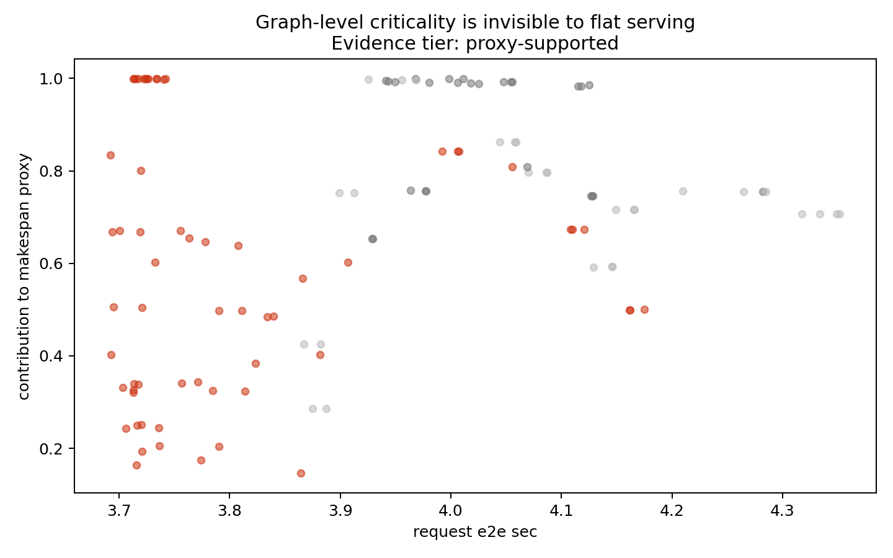
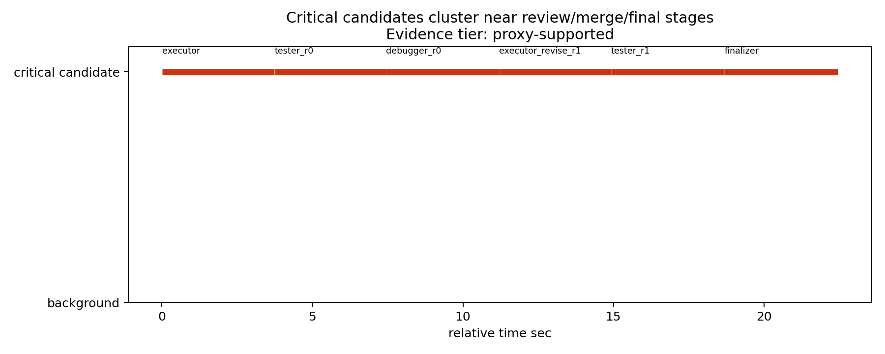
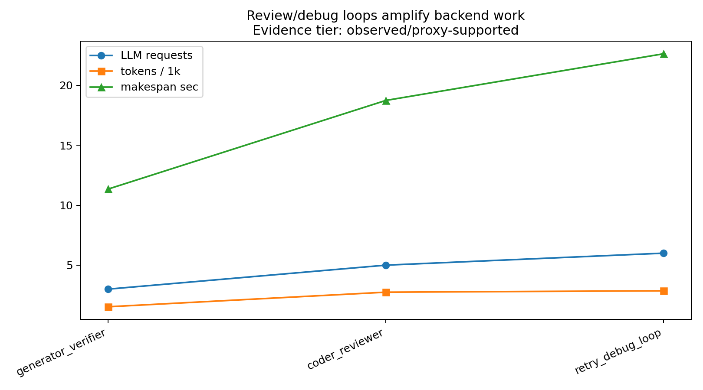
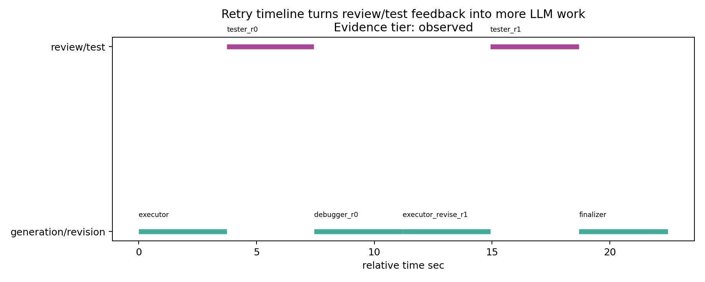

# Week2 MASBench-Arch GPU Rerun 后系统洞察报告

## 1. 本周 Trace 收集相比 Week1 的升级

Week1 的 trace 重点是证明基础 topology 的 trace schema、LLM request linkage、tool event、backend metrics sidecar 和 viewer/export 能跑通。Week2 的升级是：trace 不再只覆盖基础 topology，而是覆盖由基础拓扑组合出的 composite motif library，并进一步加入一个 higher-order meso workload 来观察复合瓶颈。

本轮 GPU rerun 已启动本地 vLLM OpenAI-compatible 服务，模型为 `local-mas-model`，并使用 replay tool snapshot 避免 Tavily live API 限额。`tool_resume_contention_meso` 单独使用真实 vLLM + controlled actual delay + synthetic local tool provider，不调用 Tavily。

已收集的新 trace：

- 5 个基础 topology：`single`、`independent`、`centralized`、`decentralized`、`hybrid`
- 12 个 Week2 semantic composite motifs：`planner_executor`、`evidence_collection`、`researcher_synthesizer`、`generator_verifier`、`coder_reviewer`、`multi_coder_branch`、`debate_reviewer`、`tool_specialist_team`、`all_gather_round`、`shared_evidence_store`、`retry_debug_loop`、`router_handoff`
- 1 个 higher-order meso workload：`tool_resume_contention_meso`

本轮 trace 根目录：

```text
traces/week2_gpu_rerun/
```

本轮新增/更新的分析产物：

- `progress/week2/compound_bottleneck_matrix.csv`
- `progress/week2/compound_tool_phase_shift_opportunities.csv`
- `progress/week2/criticality_proxy_table.csv`
- `progress/week2/figures/*.png`

## 2. Week2 Workflow 如何由基础拓扑组合而来

`mas_workflow/app/motifs/` 下大多数 workflow 更准确地说是 topology-derived semantic motifs：它们不是多个 motif 嵌套组合，而是把基础 topology 赋予任务语义后形成的可复用 MAS 子图。`tool_resume_contention_meso` 则是 higher-order meso workload，它把已有 semantic motifs 的结构元素进一步组合，用来暴露 compound bottleneck。

| Week2 workflow | 基础拓扑组合形式 | 结构语义 | 主要系统瓶颈组件 |
| --- | --- | --- | --- |
| `planner_executor` | `centralized -> finalizer` | Planner 生成 plan，Executor 执行，Finalizer 汇总 | serial control、planner/executor critical path |
| `evidence_collection` | `independent fan-out/fan-in -> merge/finalizer` | Planner 广播给 search/repo/doc/tool evidence agents，再 merge | parallel evidence、tool stall、fan-in context |
| `researcher_synthesizer` | `independent researchers -> synthesizer/finalizer` | 多 researcher 并行研究，Synthesizer 汇总 | parallel branch、fan-in context movement |
| `generator_verifier` | `centralized two-stage -> optional revision -> finalizer` | Generator 产出候选，Verifier 审核，可选 revision | verifier critical path、retry amplification |
| `coder_reviewer` | `centralized generator-verifier variant -> finalizer` | Coder 写方案，Reviewer 审核，可选 revise/review loop | review loop、critical reviewer |
| `multi_coder_branch` | `independent coders -> centralized selector/reviewer -> finalizer` | 多 coder 并行生成候选，Reviewer/Selector 选择 | parallel coding burst、selector fan-in |
| `debate_reviewer` | `decentralized peer debate -> consensus/finalizer` | 多 reviewer 交换 peer critique 后形成 consensus | peer broadcast、all-to-all context |
| `tool_specialist_team` | `centralized manager selection -> tool specialists -> merge` | Manager 选择 tool-heavy specialists，工具证据 merge | tool stall、post-tool burst、merge barrier |
| `all_gather_round` | `decentralized all-gather -> aggregator/finalizer` | 每个 agent 先产出局部消息，再接收所有 peer message 更新 | all-gather broadcast、duplicated context |
| `shared_evidence_store` | `independent writers -> shared store -> centralized readers/finalizer` | 多 writer 写 shared evidence store，reader 从共享证据读取 | shared memory dataflow、read/write context movement |
| `retry_debug_loop` | `centralized executor/tester/debugger loop -> finalizer` | Executor 产出，Tester/Verifier 失败后 Debugger 诊断并修订 | retry/debug loop、work amplification |
| `router_handoff` | `centralized router -> selected specialist -> optional handoff` | Router 选择 specialist，必要时 handoff 到替代路径 | routing control、handoff overhead |
| `tool_resume_contention_meso` | `(tool/evidence branch) + parallel coder + coder/reviewer critical path + merge/finalizer` | tool-stalled branch 延迟 resume，同时 reviewer/finalizer 主路径推进 | delayed resume burst、critical overlap opportunity |

这个结构支撑我们的文章主张：MASBench-Arch 可以用少量基础 topology 组合出一组可解释的系统瓶颈组件，而不是依赖不可控的随机 agent traces。

## 3. 本周建议重点汇报的两个 Insight

本周只建议重点汇报两个 insight：

1. **MAS graph composition creates distinct backend load shapes.**
2. **Tool-stalled branch resume can overlap with critical reviewer/finalizer requests, creating a concrete backend contention opportunity.**

`parallelism -> context movement`、`criticality invisible to backend`、`retry amplification` 仍然保留为辅助证据，但不建议作为本周主讲重点。原因是前两个 insight 最符合 Week2 的目标：一个证明 graph composition 是 workload 一等属性，另一个证明我们关心的 tool-resume compound bottleneck 已经从 planned hypothesis 变成 workflow-level observed overlap。

## 4. Evidence Tier 更新

| insight | 当前证据等级 | 本轮 GPU rerun 支持 | 仍缺失的 backend 字段 | 结论边界 |
| --- | --- | --- | --- | --- |
| Graph load shape | observed | 5 topology + 12 motif + 1 meso workload 均有真实 vLLM trace | per-request batch membership、scheduler decision | 可以说 workload shape observed，不能说调度策略优劣 |
| Tool resume overlap | observed workflow-level overlap + backend concurrency proxy | `tool_resume_contention_meso` 中 background resume requests 与 critical reviewer 明显重叠；backend metrics 显示 max running requests = 6 | per-request queue time、batch membership、scheduler wait | 可以说 contention opportunity observed，不能说 priority inversion proved |
| Context movement | proxy-supported | fan-in/all-gather motif 有 token/context movement estimate | KV residency、prefix cache hit/miss | 支撑 cache 研究动机，不证明 cache 行为 |
| Criticality invisible | proxy-supported | role/dependency proxy 可识别 critical candidate | true critical path flag、scheduler priority | 支撑 critical-path-aware serving 动机 |
| Retry amplification | observed/proxy-supported | retry/review/debug loop trace 可见额外 LLM work | 深层真实软件 debug loop | 当前只支持 bounded loop 下的 work amplification |

## 5. Compound Bottleneck Matrix



读图说明：每一行是一个基础 topology 或 composite workflow，每一列是一类系统瓶颈组件。颜色/数值越强，表示该 workload 越明确地包含这种瓶颈组件。本轮 GPU rerun 后，`tool_resume_contention_meso` 不再只是 planned：它已经观察到 tool stall、post-tool burst、critical candidate 和 contention opportunity 的 workflow-level overlap 条件。

| workload | parallel branch | barrier | fan-in | all-gather | tool stall | post-tool burst | retry loop | critical candidate | background resume | contention opportunity |
| --- | --- | --- | --- | --- | --- | --- | --- | --- | --- | --- |
| single | not observed | not observed | observed | not observed | observed | proxy | not observed | proxy | proxy | proxy |
| independent | observed | observed | observed | not observed | observed | observed | not observed | observed | proxy | proxy |
| centralized | observed | observed | observed | not observed | observed | observed | not observed | observed | proxy | proxy |
| decentralized | observed | observed | observed | observed | observed | observed | not observed | observed | proxy | proxy |
| hybrid | observed | observed | observed | not observed | observed | observed | not observed | observed | proxy | proxy |
| planner_executor | not observed | not observed | observed | not observed | not observed | not observed | not observed | observed | not observed | not observed |
| evidence_collection | observed | observed | observed | not observed | observed | observed | not observed | observed | proxy | proxy |
| researcher_synthesizer | observed | observed | observed | not observed | observed | observed | not observed | observed | proxy | proxy |
| generator_verifier | not observed | not observed | observed | not observed | not observed | not observed | observed | observed | not observed | not observed |
| coder_reviewer | not observed | not observed | observed | not observed | not observed | not observed | observed | observed | not observed | not observed |
| multi_coder_branch | observed | observed | observed | not observed | not observed | not observed | not observed | observed | not observed | not observed |
| debate_reviewer | observed | observed | observed | observed | not observed | not observed | not observed | observed | not observed | not observed |
| tool_specialist_team | observed | observed | observed | not observed | observed | observed | not observed | observed | proxy | proxy |
| all_gather_round | observed | observed | observed | strong observed | not observed | not observed | not observed | observed | not observed | not observed |
| shared_evidence_store | observed | observed | observed | not observed | observed | observed | not observed | observed | proxy | proxy |
| retry_debug_loop | not observed | not observed | observed | not observed | not observed | not observed | observed | observed | not observed | not observed |
| router_handoff | not observed | not observed | observed | not observed | not observed | not observed | not observed | observed | not observed | not observed |
| tool_resume_contention_meso | observed | observed | observed | not observed | strong observed | strong observed | not observed | strong observed | strong observed | strong observed |

## 6. Insight 1: MAS graph composition creates distinct backend load shapes

**Claim:** MAS workload 不能只用总 token 数或总 request 数描述。不同 graph composition 会改变 request 到达形状、并行宽度、barrier 位置、fan-in 位置和 backend burst pattern。因此 graph structure 是 workload 的一等属性。



读图说明：纵轴是不同 topology/motif，横轴是 workload load-shape 指标，包括 LLM request 数、最大并行宽度、barrier wait、request burstiness、context amplification 和 tool time。颜色越亮表示该 workload 在对应维度上的压力越高。重点不是比较谁更慢，而是看不同 graph 给 backend 施加了不同类型的负载。

**本轮真实 trace 证据：**

- `single`: 2 个 LLM request，1 个 tool event，makespan 约 7.6s。
- `debate_reviewer`: 12 个 LLM request，17 条 dataflow edge，makespan 约 23.8s，体现 peer debate/all-to-all message 负载。
- `hybrid`: 13 个 LLM request，5 个 tool event，19 条 edge，makespan 约 27.9s，体现 nested manager + peer + tool 的混合形态。
- `multi_coder_branch`: 6 个 LLM request，8 条 edge，体现 parallel candidate generation 后 selector/reviewer fan-in。
- `tool_specialist_team`: 6 个 LLM request，4 个 tool event，体现 tool-heavy fan-out/fan-in。

**Mechanism:** backend 看到的是一串 OpenAI-compatible requests，但这些 requests 的 arrival burst、parallel width、prompt size 和等待关系由 MAS graph 决定。两个 request count 相近的 workload，可能一个是 serial manager chain，另一个是并行 fan-out 后 fan-in，二者对 batching、queueing 和 cache 的压力不同。

**Limitation:** 本轮有真实 vLLM trace 和 backend metrics sidecar，但仍缺少 per-request batch membership 和 scheduler decision，因此不能把 workload shape 直接解释成某种 scheduler 行为已经被证明。

**汇报说法：** Week2 的最稳结论是：MAS graph structure 是 workload 的一等属性。它决定 backend load shape，而不只是改变总 token 数或总 request 数。

## 7. Insight 2: Tool-stalled branch resume overlaps critical reviewer request

**Claim:** tool stall 不只是“工具慢”。当 tool-stalled background branch 在工具返回后 resume，它会向 backend 注入 delayed LLM request burst。如果主路径没有等所有工具分支，而是继续推进到 reviewer/finalizer 阶段，这个 delayed burst 可以与 critical-path request 发生时间重叠，形成具体的 backend contention opportunity。



读图说明：横轴是 `tool_resume_contention_meso` 的相对时间。蓝色长条表示 controlled tool delay，绿色条表示 tool return 后的 background resume LLM requests，红色条表示 critical reviewer/finalizer/merge candidate。现在这张图已经不是简单 pipeline：background resume requests 与 `critical_reviewer` 在时间上重叠。



读图说明：横轴是 motif/topology，纵轴是 opportunity score。`tool_resume_contention_meso` 得分最高，说明它同时具备 tool stall、post-tool burst、critical candidate、fan-in/merge 和 overlap window，是后续研究 backend contention 的代表性 workload。

**本轮真实 trace 证据：**

代表 trace：

```text
traces/week2_gpu_rerun/tool_resume_contention_meso/manual_2eeb1af41376/20260528_144746_528234.jsonl
```

关键时间窗口：

| event | 时间区间 sec | 解释 |
| --- | --- | --- |
| 4 个 controlled tool delay | 3.73 - 5.74 | background tool branches stalled |
| 4 个 resume evidence processors | 5.74 - 10.09 | tool return 后 delayed background LLM burst |
| `critical_reviewer` | 7.79 - 11.70 | critical-path reviewer request |
| `evidence_merge` | 11.71 - 15.59 | downstream fan-in/merge |
| `finalizer` | 15.60 - 19.39 | final critical stage |

最关键的现象是：4 个 background resume LLM requests 在 5.74-10.09s 运行，而 `critical_reviewer` 在 7.79-11.70s 运行。两者存在约 2.3s 的直接重叠窗口。backend metrics sidecar 中同时记录到 `max_num_requests_running = 6`，说明该窗口确实形成了 backend 并发运行压力。

**Mechanism:** controlled tool delay 把 background evidence branch 的 LLM request 从 workflow 早期推迟到 5.7s 后；critical path 中 coder/reviewer 没有等待这些 delayed tool branches 完全结束，而是在 7.8s 左右进入 reviewer。因此 delayed resume burst 与 reviewer request 同时进入/运行于 backend。

**Limitation:** 这已经可以说是 workflow-level overlap observed 和 backend concurrency proxy observed，但还不能说“证明了 scheduler priority inversion”。本轮 summary 中 `total_queue_wait = 0.0`，backend metrics 中 `max_num_requests_waiting = 0.0`，说明当前容量足够，没有明显排队。我们能主张的是 contention opportunity，而不是真实排队争用或优先级反转。

**汇报说法：** Week2 已经把 tool-resume compound bottleneck 从 planned hypothesis 推进到真实 vLLM trace 下的 observed overlap opportunity。下一步需要更高负载、更小 serving capacity 或更多并发 branches，才能验证是否会转化为 queueing/TTFT/TPOT degradation。

## 8. 辅助 Insight: Parallelism reappears as context movement



读图说明：横轴是 fan-in width，纵轴是下游 fan-in 节点 input tokens / 上游分支平均 output tokens。越靠右表示汇聚分支越多，越靠上表示分支输出在下游 prompt 中造成更强 context movement。



读图说明：横轴表示 fan-in aggregation pressure，纵轴表示 all-to-all broadcast pressure。`multi_coder_branch`、`researcher_synthesizer` 更偏 fan-in；`debate_reviewer`、`all_gather_round` 更偏 broadcast。

这条 insight 建议作为辅助，不作为本周主讲。它支持 prefix sharing、context cache、shared artifact cache 的动机，但当前仍是 workload-level token proxy，不能声称已经观察到 KV cache hit/miss。

## 9. 辅助 Insight: Graph-level criticality is invisible to flat serving



读图说明：每个点是一条 LLM request。横轴是 request 自身耗时或输入规模 proxy，纵轴是 makespan contribution proxy；critical candidate 和 background candidate 用颜色区分。图说明 backend 只看到 request cost，看不到 reviewer/finalizer 等 graph-level criticality。



读图说明：红色条表示 critical candidate request，灰色条表示 background request。靠近尾部的 reviewer/finalizer/merge 请求通常更接近 makespan 决定路径。

这条 insight 支撑 critical-path-aware serving 的动机，但当前仍是 graph-level proxy。

## 10. 辅助 Insight: Review/debug loops amplify backend work



读图说明：横轴是带 review/verify/debug loop 的 workflow，折线表示 LLM request count、total tokens 和 makespan。loop 型 workflow 同时增加 request 数、token 数和路径长度。



读图说明：timeline 展示 generation/revision 与 review/test 阶段如何交替出现。一次 review/test feedback 会触发额外 LLM 调用并延长路径。

这条 insight 当前可以作为补充材料，不建议作为本周两个主 insight 之一。原因是 loop depth 还较浅，需要 full software workflow 才能观察更真实的非线性 debug amplification。

## 11. 仍然不能过度声称的内容

本轮已经有真实 vLLM trace，但仍不能声称：

- 已证明 scheduler priority inversion
- 已观察到 KV idle residency
- 已验证 prefix cache optimization
- 已证明 cache hit/miss 改善
- 已证明某种 scheduler policy 更优

可以谨慎声称：

- observed workload-level graph load shapes
- observed tool-resume / critical-reviewer temporal overlap in a composed meso workload
- backend concurrency proxy observed through `max_num_requests_running`
- cache/scheduler research motivation is stronger after GPU rerun

## 12. 本周汇报建议

本周建议只讲两个主 insight：

**Insight 1: MAS graph composition creates distinct backend load shapes.**

讲法：我们从基础 topology 扩展到 topology-derived semantic motifs，并用真实 vLLM trace 证明不同 graph composition 会产生不同 request burst、parallel width、barrier、fan-in、tool-time 形态。MAS workload 不能只用总 token 或总 request 数描述。

**Insight 2: Tool-stalled branch resume can overlap with critical reviewer request.**

讲法：我们构造了 higher-order meso workload `tool_resume_contention_meso`，它不是孤立基础 motif，而是 tool/evidence branch、parallel coder branch、coder/reviewer critical path 和 merge/finalizer 的组合。真实 vLLM trace 中，4 个 tool-return 后的 background resume requests 与 `critical_reviewer` 明显重叠，backend metrics 显示 max running requests 达到 6。这说明该 compound bottleneck 已经从 planned hypothesis 变成 observed contention opportunity。当前还不能说 priority inversion，因为没有 per-request batch membership/queueing，且本次没有明显 waiting queue。

最后一句建议这样收束：

> Week2 的主要贡献是把 MASBench-Arch 从基础拓扑 trace 推进到可组合 motif trace，并首次在真实 vLLM trace 中观察到 tool-stalled branch resume 与 critical reviewer request 的重叠窗口，为后续 critical-path-aware serving 和 tool-aware scheduling 提供了具体 workload 证据。
