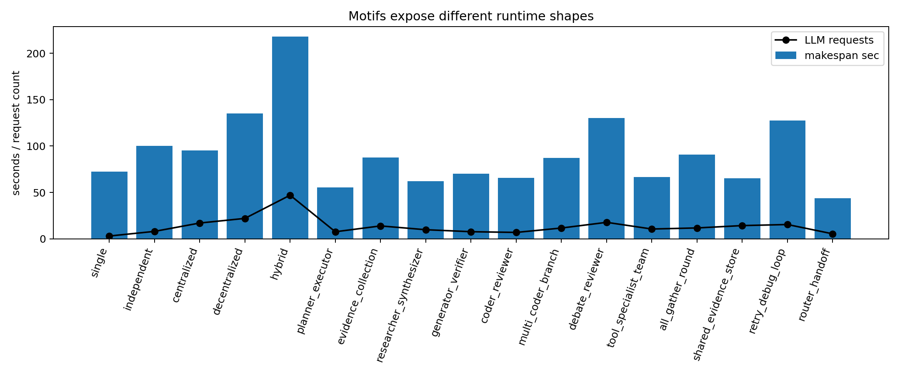
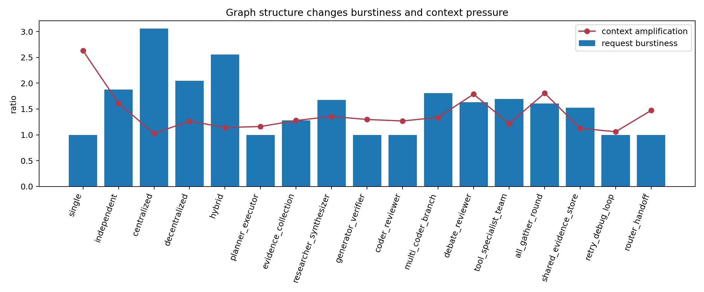
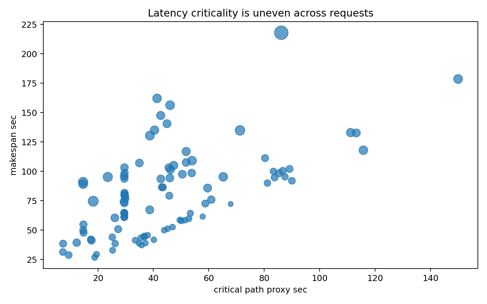
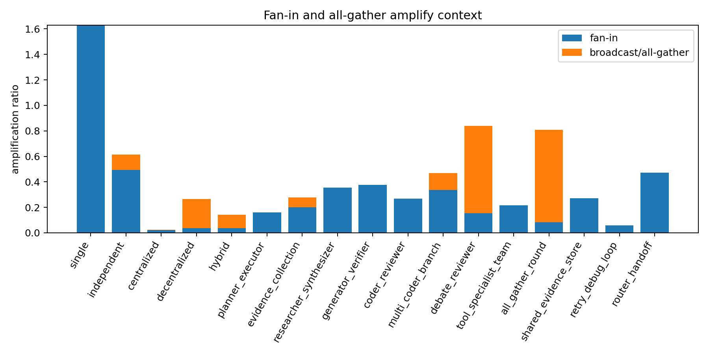
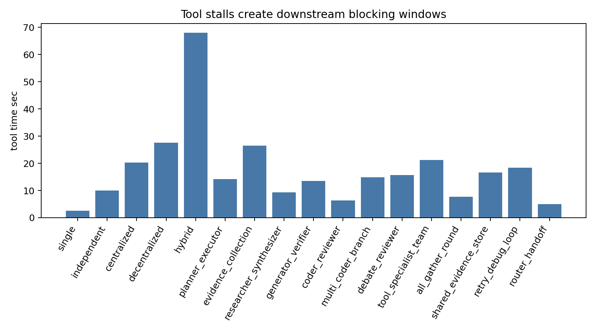
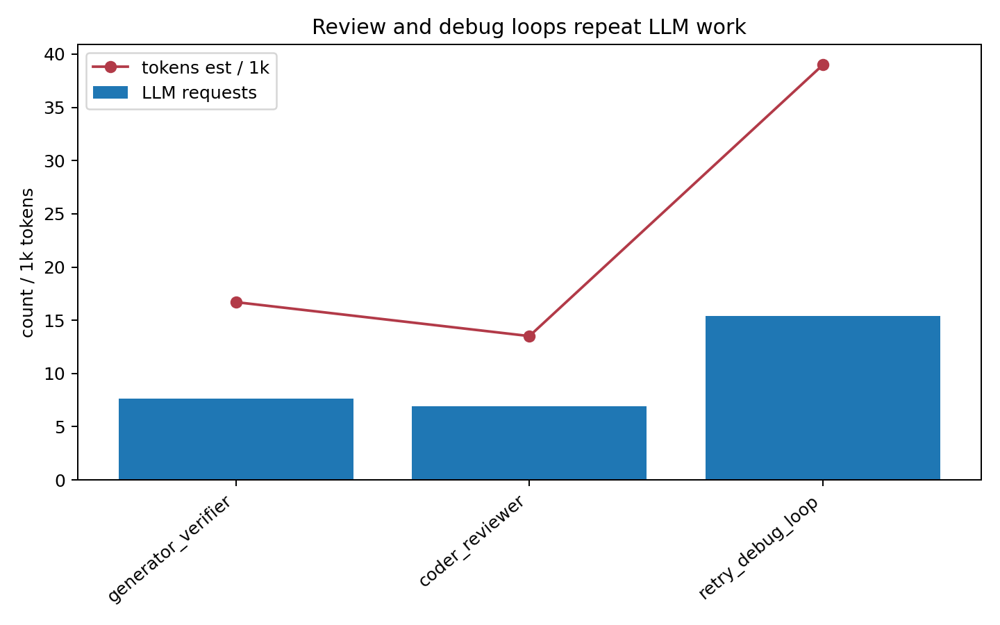

# Week2 MASBench-Arch Trace Characterization

## 1. 范围

本报告只分析 Week2 已经生成的 trace。分析过程没有重新运行 workload，没有重新采集 trace，没有分析任务准确率，没有修改 vLLM scheduler 或 KV manager，也没有设计最终 full workflow 或做 case study。

## 2. Trace 覆盖情况

| name | run_count | avg_makespan_sec | avg_llm_request_count | avg_total_tokens_est | avg_tool_time_sec | avg_barrier_wait_sec | avg_context_amplification_ratio | detected_signatures | confidence |
| --- | --- | --- | --- | --- | --- | --- | --- | --- | --- |
| single | 1 | 72.2179 | 3 | 6688 | 2.5003 | 0 | 2.6301 | critical_path_concentration;fanin_context_amplification | medium |
| independent | 1 | 100.0115 | 8 | 13271 | 9.9974 | 2.6765 | 1.614 | critical_path_concentration;parallel_request_burst;barrier_straggler;fanin_context_amplification;tool_stall_blocking;post_tool_burst | medium |
| centralized | 1 | 95.3866 | 17 | 24216 | 20.2913 | 3.8458 | 1.026 | serial_manager_bottleneck;critical_path_concentration;parallel_request_burst;barrier_straggler;tool_stall_blocking;post_tool_burst | high |
| decentralized | 1 | 134.8789 | 22 | 42698 | 27.627 | 18.804 | 1.2663 | critical_path_concentration;parallel_request_burst;barrier_straggler;fanin_context_amplification;all_to_all_broadcast_amplification;tool_stall_blocking;post_tool_burst | medium |
| hybrid | 1 | 217.9545 | 47 | 121700 | 68.0119 | 46.6863 | 1.1423 | serial_manager_bottleneck;critical_path_concentration;parallel_request_burst;barrier_straggler;fanin_context_amplification;all_to_all_broadcast_amplification;tool_stall_blocking;post_tool_burst | medium |
| planner_executor | 5 | 55.4448 | 7.6 | 24090.6 | 14.206 | 0 | 1.1606 | critical_path_concentration;tool_stall_blocking;serial_manager_bottleneck;fanin_context_amplification | high |
| evidence_collection | 9 | 87.7079 | 13.8889 | 33838.33 | 26.5521 | 25.2196 | 1.2776 | barrier_straggler;tool_stall_blocking;critical_path_concentration;fanin_context_amplification;post_tool_burst;parallel_request_burst | medium |
| researcher_synthesizer | 10 | 62.1662 | 9.8 | 14333.5 | 9.2914 | 14.0162 | 1.3563 | parallel_request_burst;barrier_straggler;tool_stall_blocking;post_tool_burst;critical_path_concentration;fanin_context_amplification | medium |
| generator_verifier | 9 | 70.3285 | 7.6667 | 16701.67 | 13.5368 | 0 | 1.2971 | critical_path_concentration;fanin_context_amplification;tool_stall_blocking;retry_amplification;serial_manager_bottleneck | medium |
| coder_reviewer | 9 | 65.7373 | 6.8889 | 13512.89 | 6.2992 | 0 | 1.2685 | serial_manager_bottleneck;critical_path_concentration;fanin_context_amplification;tool_stall_blocking;retry_amplification | high |
| multi_coder_branch | 8 | 87.3465 | 11.625 | 23510 | 14.8847 | 20.7805 | 1.3379 | serial_manager_bottleneck;critical_path_concentration;parallel_request_burst;barrier_straggler;tool_stall_blocking;fanin_context_amplification;post_tool_burst | high |
| debate_reviewer | 8 | 130.2424 | 17.75 | 40795.12 | 15.6215 | 30.0148 | 1.7875 | serial_manager_bottleneck;parallel_request_burst;barrier_straggler;all_to_all_broadcast_amplification;fanin_context_amplification;tool_stall_blocking;post_tool_burst | high |
| tool_specialist_team | 9 | 66.6441 | 10.5556 | 21536.78 | 21.2222 | 23.5631 | 1.2155 | barrier_straggler;tool_stall_blocking;post_tool_burst;parallel_request_burst;fanin_context_amplification;critical_path_concentration | medium |
| all_gather_round | 7 | 90.7976 | 11.7143 | 28532.71 | 7.7078 | 29.0146 | 1.807 | barrier_straggler;all_to_all_broadcast_amplification;tool_stall_blocking;post_tool_burst;fanin_context_amplification;parallel_request_burst;critical_path_concentration | medium |
| shared_evidence_store | 4 | 65.4116 | 14.25 | 32367.25 | 16.6615 | 23.9538 | 1.1276 | barrier_straggler;fanin_context_amplification;post_tool_burst;shared_memory_dataflow;tool_stall_blocking;parallel_request_burst | medium |
| retry_debug_loop | 5 | 127.6557 | 15.4 | 38987.4 | 18.4116 | 0 | 1.0597 | critical_path_concentration;tool_stall_blocking;retry_amplification;fanin_context_amplification;post_tool_burst | medium |
| router_handoff | 8 | 43.6179 | 5.375 | 5556.12 | 4.9819 | 0 | 1.4726 | serial_manager_bottleneck;critical_path_concentration;fanin_context_amplification;tool_stall_blocking | high |

本次共扫描 96 个 run，覆盖 5 个基础 topology 和 12 个 composite motif。所有预期 topology/motif 均有 trace；没有 `trace_missing` 项。

## 3. Backend 对齐质量

已测量字段：graph event 的时间戳和 duration、client 侧 LLM request duration、tool 的 measured/replayed latency，以及存在 sidecar 时从 vLLM `/metrics` 采样到的窗口级指标。

估计字段：带 `_est` 后缀的 token 字段、dataflow token amplification、context duplication，以及缺少显式 `critical_path_flag` 时推断出的 critical-path proxy。

当前不可用字段：per-request vLLM queue time、batch membership、KV allocation/eviction、prefix-cache hit/miss、tool stall 期间的 idle KV residency，以及每个 request 的可靠 streaming first-token timestamp。

本次 backend alignment 结果：`request_id_for_backend` 覆盖率为 1.0，token field 覆盖率为 1.0，client-side timing 覆盖率为 1.0；backend metrics sidecar 覆盖 96/96 个 run。

## 4. Per-Motif Summary

第 2 节表格给出了每个 topology/motif 的紧凑汇总，包括 run 数量、平均 makespan、平均 LLM request 数、估计 token 总量、tool time、barrier wait、context amplification ratio、检测到的 bottleneck signature 和置信度。完整机器可读结果保存在 `progress/week2/week2_trace_characterization_summary.json` 和 `progress/week2/week2_trace_characterization_tables.csv`。

## 5. Control-flow Bottlenecks

检测到的 control-flow signature：

- `serial_manager_bottleneck`: 40 个 run；代表 trace `../traces/coder_reviewer/manual_036e5114cf89/20260524_130340_815282.jsonl`
- `critical_path_concentration`: 74 个 run；代表 trace `../traces/all_gather_round/manual_48abc59335d4/20260526_200528_876759.jsonl`
- `parallel_request_burst`: 48 个 run；代表 trace `../traces/all_gather_round/manual_48abc59335d4/20260524_131910_620380.jsonl`
- `barrier_straggler`: 59 个 run；代表 trace `../traces/all_gather_round/manual_48abc59335d4/20260524_131910_620380.jsonl`
- `retry_amplification`: 13 个 run；代表 trace `../traces/coder_reviewer/manual_036e5114cf89/20260524_133519_316267.jsonl`

集中式和分阶段 motif 中，manager/reviewer/finalizer 类角色会形成串行控制段。并行 motif 会产生短时间 LLM request burst，并在 barrier 前暴露 straggler gap。review/debug 类 motif 会把一次局部 request-changes 或 fail decision 放大为重复 LLM 调用。

## 6. Data-flow Bottlenecks

检测到的 data-flow signature：

- `fanin_context_amplification`: 85 个 run；代表 trace `../traces/all_gather_round/manual_48abc59335d4/20260524_134240_396107.jsonl`
- `all_to_all_broadcast_amplification`: 17 个 run；代表 trace `../traces/all_gather_round/manual_48abc59335d4/20260524_131910_620380.jsonl`

Synthesizer、evidence merge、reviewer、selector 和 finalizer 等 fan-in 节点会消费来自多个上游 agent 的 artifact，从而增加输入上下文压力。debate 和 all-gather motif 进一步引入 peer/broadcast token movement 和 duplicated context pressure。

## 7. Backend Serving Observations

现有 trace 能够通过 `request_id_for_backend`、`node_id`、`agent_role`、`model`、`backend_base_url`、token 字段和 timing 字段，把 MAS graph node 对齐到 OpenAI-compatible vLLM request。并行 motif 会产生短时间 request burst；tool-heavy motif 会在 tool 返回后触发 merge/finalizer 侧的集中请求。

当前 backend metrics 适合做粗粒度 serving window 分析，但不足以直接支撑 scheduler/cache/memory 内部结论，因为缺少 per-request queue time、batch membership、KV/cache 字段和 prefix cache hit/miss。

## 8. Tool and Memory Observations

检测到的 tool/memory signature：

- `tool_stall_blocking`: 83 个 run；代表 trace `../traces/all_gather_round/manual_48abc59335d4/20260524_131910_620380.jsonl`
- `post_tool_burst`: 50 个 run；代表 trace `../traces/all_gather_round/manual_48abc59335d4/20260524_131910_620380.jsonl`
- `shared_memory_dataflow`: 4 个 run；代表 trace `../traces/shared_evidence_store/manual_448267fd8f10/20260524_132006_220185.jsonl`

Tool-heavy motif 中存在 measured 或 replayed tool latency，并且下游 aggregation/finalizer 会受到 tool 返回时机影响。shared evidence traces 中可以看到 read/write dataflow；本次统计到 24 次 memory write 和 16 次 memory read。当前没有观察到 stale read，`stale_read_count = 0`。

这些结果支持后续做 tool-aware scheduling/cache management 的动机，但还不能声称已经观测到 KV idle residency 或 version-aware cache 行为。

## 9. Week2 进度汇报可用的初步 insight

### Insight 1: 不同 MAS motif 暴露出不同的 runtime bottleneck signature。

Supporting motifs: centralized/planner 类 motif、multi_coder_branch、evidence_collection、tool_specialist_team、debate_reviewer、all_gather_round、coder_reviewer、retry_debug_loop。

Supporting metrics: centralized/planner 类 motif 出现 manager serialization；branch motif 出现 request burst 和 straggler；tool-heavy motif 出现 tool stall；debate/all-gather 出现 broadcast/context amplification；review/debug motif 出现 retry amplification。

Supporting figure: 

图读法：横轴是不同 topology/motif，蓝色柱表示平均端到端 makespan 秒数，黑色折线表示平均 LLM request 数。读图时不要只看某一个绝对值，而是看“同一后端下，不同 graph structure 的运行形状是否明显不同”：柱子高说明该结构整体耗时长，折线高说明该结构触发的模型请求次数多。

图说明：`hybrid`、`debate_reviewer`、`retry_debug_loop` 等结构的 makespan 更高，说明多阶段控制、peer communication 或 retry/debug loop 会拉长端到端路径；`hybrid`、`decentralized`、`debate_reviewer` 的 LLM request 数更高，说明复杂 MAS 图会把一次任务拆成更多 backend request。这张图支持“不同 motif 不是同一 workload 的微小变体，而是会暴露不同 runtime bottleneck signature”的结论。

Representative trace paths: `../traces/coder_reviewer/manual_036e5114cf89/20260524_130340_815282.jsonl`, `../traces/all_gather_round/manual_48abc59335d4/20260524_131910_620380.jsonl`, `../traces/coder_reviewer/manual_036e5114cf89/20260524_133519_316267.jsonl`

Confidence: medium

Caveat: 部分 signature 依赖 proxy 推断，因为当前 trace 并没有为所有节点提供显式 `critical_path_flag`、queue time 或完整 scheduler 字段。

### Insight 2: MAS graph structure 应该被视为 workload 的一等属性。

Supporting motifs: 基础 topology 与全部 composite motif。

Supporting metrics: 在同一个 OpenAI-compatible local backend 下，不同 graph structure 会导致不同 makespan、LLM request burstiness、barrier wait 和 context amplification ratio。

Supporting figure: 

图读法：横轴仍是 topology/motif。蓝色柱是 request arrival burstiness，表示 LLM request 是否集中在短时间窗口内到达；红色折线是 context amplification ratio，表示输入上下文和 dataflow artifact 的估计放大程度。柱子越高，越像并行分支同时打到 backend；红线越高，越说明上下文被复制、聚合或广播得更多。

图说明：并行、debate、all-gather、multi-coder 等结构会让 request 到达更突发，fan-in/all-gather 类结构会让 context amplification ratio 上升。这说明 MAS workload 的关键不是只有“总 token 数”或“总请求数”，graph structure 本身会改变 backend 面临的到达模式和上下文压力。因此 scheduler/cache 研究需要把 MAS graph structure 作为 workload 属性记录下来。

Representative trace paths: `../traces/all_gather_round/manual_48abc59335d4/20260524_131910_620380.jsonl`, `../traces/all_gather_round/manual_48abc59335d4/20260524_134240_396107.jsonl`

Confidence: medium

Caveat: 这些是已有 Week2 traces 的 characterization，不是严格控制 prompt 和输入规模的 factorial experiment。

### Insight 3: 并非所有 agent request 对端到端 latency 同等关键。

Supporting motifs: staged motif、all_gather_round、debate_reviewer、retry_debug_loop。

Supporting metrics: critical-path proxy 与 makespan 有相关趋势；串行 controller/reviewer/finalizer 节点对 makespan 的影响通常比非关键并行 branch 更直接。

Supporting figure: 

图读法：每个点代表一个 run。横轴是 critical path proxy 秒数，纵轴是 makespan 秒数，点越大表示该 run 的 LLM request 数越多。如果点大致沿右上方向分布，说明关键路径 proxy 越长，整体 makespan 往往也越长。

图说明：图中能看到 critical path proxy 与 makespan 有一定同向关系，但这个结论只能低置信度使用。原因是当前 trace 并非所有节点都有显式 `critical_path_flag` 和完整 dependency edge，所以横轴是 best-effort proxy，而不是严格图算法算出的真实 critical path。它适合用来说明“request 的 latency criticality 可能不均匀”，但还不能用来精确判断每个 backend request 对 makespan 的边际贡献。

Representative trace paths: `../traces/all_gather_round/manual_48abc59335d4/20260526_200528_876759.jsonl`

Confidence: low

Caveat: 当前缺少完整显式 dependency edges 和稳定的 `critical_path_flag`，因此只能作为低置信度观察。后续需要显式 critical path 标注才能把该 insight 提升为高置信度结论。

### Insight 4: Fan-in 节点会放大 context，支持 prefix/context-cache 机制的研究动机。

Supporting motifs: researcher_synthesizer、evidence_collection、multi_coder_branch、debate_reviewer、all_gather_round。

Supporting metrics: synthesizer、reviewer、merge、selector 和 finalizer 的输入会聚合多个上游 artifact；all-gather/debate 还会产生 broadcast 和 duplicated context 压力。

Supporting figure: 

图读法：这张图只展示有明显 fan-in 或 broadcast 压力的结构。蓝色部分是 fan-in amplification ratio，表示 merge/synthesizer/reviewer/finalizer 等节点聚合上游 artifact 带来的输入放大；叠加部分是 broadcast/all-gather amplification ratio，表示 peer message、broadcast 或 duplicated context 带来的额外放大。柱子越高，说明该 motif 越容易把多个 agent 的输出重新塞回后续 prompt。

图说明：`debate_reviewer`、`all_gather_round`、`multi_coder_branch`、`researcher_synthesizer`、`evidence_collection` 等结构有明显 context amplification。这个现象支持 prefix/context-cache 研究动机：如果多个后续节点反复消费相似的共享上下文、证据集合或 peer messages，backend 有机会通过 prefix/cache 机制减少重复处理。不过这里的 token 是 workload-level estimate，不能直接解释为 vLLM 内部 KV cache 命中或占用。

Representative trace paths: `../traces/all_gather_round/manual_48abc59335d4/20260524_134240_396107.jsonl`, `../traces/all_gather_round/manual_48abc59335d4/20260524_131910_620380.jsonl`

Confidence: medium

Caveat: 带 `_est` 后缀的 token 数是 workload-level proxy，不是 vLLM 内部 token cache 或 KV cache 计数。

### Insight 5: Tool-stalled branches 支持 tool-aware scheduling/cache management 的研究动机。

Supporting motifs: evidence_collection、tool_specialist_team，以及包含 search/tool 调用的 all_gather、debate 和 shared evidence traces。

Supporting metrics: tool-heavy motif 存在可测量或可回放的 tool latency；tool 返回后可能触发 merge/finalizer 的 downstream request burst。

Supporting figure: 

图读法：横轴是包含 tool 调用的 topology/motif，纵轴是平均 tool time 秒数。柱子越高，说明该结构中 agent 等待搜索、repo/doc/test 等工具结果的时间越多。这里的 tool time 可能来自真实测量，也可能来自 replay snapshot 中保留的 measured duration。

图说明：`hybrid`、`decentralized`、`evidence_collection`、`tool_specialist_team`、`retry_debug_loop` 等结构有较明显 tool time。对 MAS serving 来说，tool stall 的关键影响不是工具本身占用 GPU，而是它会让后续 merge/finalizer/reviewer 请求被阻塞，并可能在 tool 返回后形成新的 request burst。这张图支持 tool-aware scheduling/cache management 的动机，但当前 trace 没有 KV residency 字段，所以不能声称已经观察到 idle KV，只能说需要下一步 instrumentation。

Representative trace paths: `../traces/all_gather_round/manual_48abc59335d4/20260524_131910_620380.jsonl`

Confidence: medium

Caveat: 当前 trace 没有 KV residency 字段，因此这里只能说 tool stall 暗示未来需要 KV idle residency instrumentation，不能说已经观测到 idle KV。

### Insight 6: Review/debug loop 会把小的局部迭代放大为重复 LLM invocation。

Supporting motifs: coder_reviewer、generator_verifier、retry_debug_loop。

Supporting metrics: retry/debug/review 类 motif 中出现额外 verifier/reviewer/debug step，带来更多 LLM request、额外 token 和额外 client-side LLM time。

Supporting figure: 

图读法：横轴是 review/retry/debug 相关 motif。蓝色柱表示平均 LLM request 数，红色折线表示平均估计 token 总量除以 1000。柱子高说明 loop 触发了更多模型调用，红线高说明这些调用带来了更多 token work。

图说明：`retry_debug_loop`、`generator_verifier`、`coder_reviewer` 等 motif 展示了 review/debug 控制流的放大效应：一次 request_changes、verification fail 或 debug step 会引入额外 LLM request 和额外 token。这个 insight 的重点不是任务是否修好了，而是 backend workload 形态发生了变化：小的局部迭代会变成重复模型调用，并拉长 makespan 或增加 serving load。

Representative trace paths: `../traces/coder_reviewer/manual_036e5114cf89/20260524_133519_316267.jsonl`

Confidence: medium

Caveat: 当前 benchmark 设置限制了 loop depth，因此该 insight 说明 amplification 已经出现，但还不能外推到更深或更长的真实 debug workflow。

## 10. 缺失字段与下一步

- 更可靠地把 `request_id_for_backend` 传播到 backend log
- 每个 request 的 streaming first-token timestamp
- per-request real TTFT 和 TPOT
- vLLM queue time 与 scheduler wait
- batch membership over time
- KV allocation、eviction 和 residency interval
- prefix cache hit/miss 与 shared prefix hash
- 显式 `critical_path_flag` 和完整 dependency edges
- token-level shared-prefix hash，用于 fan-in/fan-out 复用分析
