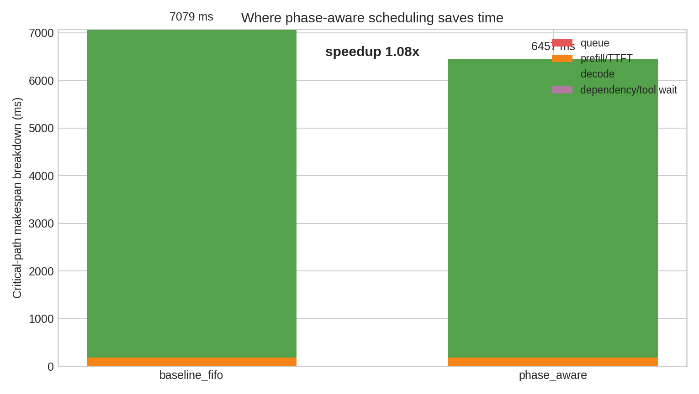
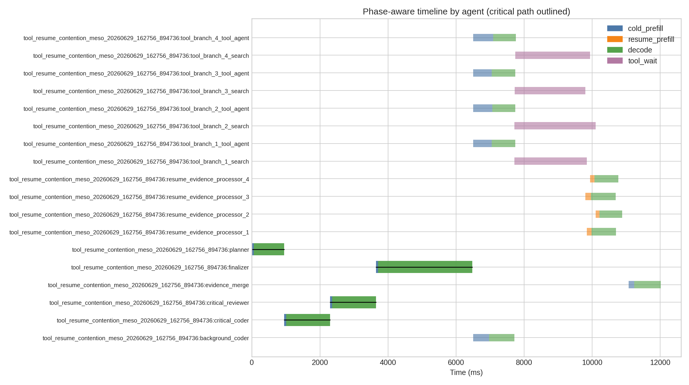
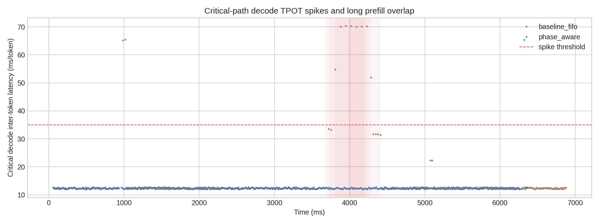
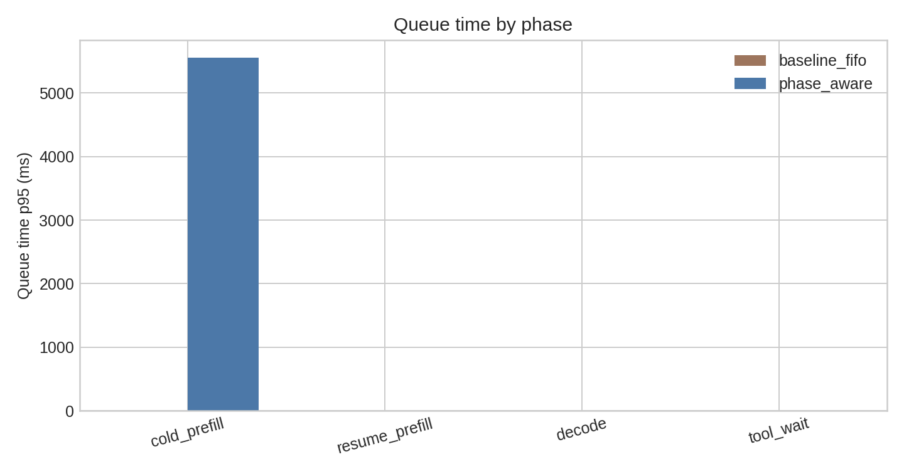

# Week 6：AgentServe-style Phase-aware Scheduling Case Study

## 实验目标

在一条固定的 tool-call multi-agent workflow replay 上验证：非关键 agent 的 long cold/resume prefill 会与关键路径 short decode 重叠，并造成 critical-path decode TPOT spike。外部 phase-aware admission scheduler 优先提交 critical decode 和 critical short resume prefill；当 TPOT 不稳定或 critical decode 活跃时，延后 non-critical cold prefill 和 long resume prefill。

## 核心结果

| metric | baseline_fifo | phase_aware |
|---|---:|---:|
| workflow makespan（ms） | 6875.4 | 6359.0 |
| 加速比 | 1.00x | 1.08x |
| critical path latency（ms） | 6875.4 | 6359.0 |
| critical decode TPOT p95（ms） | 28.8 | 12.7 |
| TPOT spike count | 10 | 1 |
| delayed prefill count | 0 | 5 |
| delayed prefill tokens | 0 | 1752 |

## Replay 来源

- source policy：`full_workflow_trace_derived_replay`
- source trace：`results/case_studies/agentserve_phase/full_workflow_source_trace/tool_resume_contention_meso/manual_fe620dfda172/20260629_162756_894736.jsonl`
- source LLM spans：`14`
- source tool spans：`4`
- token calibration：`source_prompt_tokens_with_role_min_output_long_resume_multiplier_and_realistic_critical_decode_length`

## 图表说明

### Workflow makespan 与 speedup

baseline FIFO 与 phase-aware 的 critical-path makespan 对比，并用 stacked bar 展示 queue、prefill/TTFT、decode、dependency/tool wait 各部分贡献。

### Phase-aware agent timeline

按 agent 展示 phase-aware 模式下的 cold/resume prefill、decode 和 tool_wait 时间线，关键路径 span 已突出显示。

### Critical decode TPOT spike timeline

展示 critical decode TPOT 时间线，以及 long prefill overlap window。可以直观看到 baseline 中 critical decode TPOT spike 更多，而 phase-aware admission 明显压低 spike。

### Queue time by phase

按 phase 对比 queue time p95。phase-aware 的代价主要体现在 non-critical prefill queue time 增加，用它换取 critical decode 稳定性。

## 方法说明

本 case study 采用两阶段流程：先生成完整 MAS workflow source trace，再从该 trace 派生 baseline FIFO 与 phase-aware 两组 replay。两组 replay 使用相同任务、prompt、tool outputs、随机种子和 arrival/dependency pattern；差异只来自外部 admission scheduler。

本次尝试启动 pip vLLM 服务时，`/data/models/Qwen3.5-35B-A3B` 因当前 Transformers 不识别 `qwen3_5_moe` 架构失败；`/data/models/Qwen3-8B` 在禁用 FlashInfer sampler、V1 engine 和 CUDA graph 后仍出现 engine 子进程退出。因此当前提交的是完整 workflow source trace 派生的 deterministic replay artifact。

## 局限性

本 case study 不修改 vLLM，也不实现 CUDA Green Context；它只验证 MAS workflow 层面的 phase-aware scheduling insight。真实 H100 + vLLM streaming replay 可复用同一 request sequence 和 `LocalLLMClient.invoke_streaming_with_metadata()`，但需要先解决当前 pip vLLM / Transformers / FlashInfer 启动兼容性问题。
