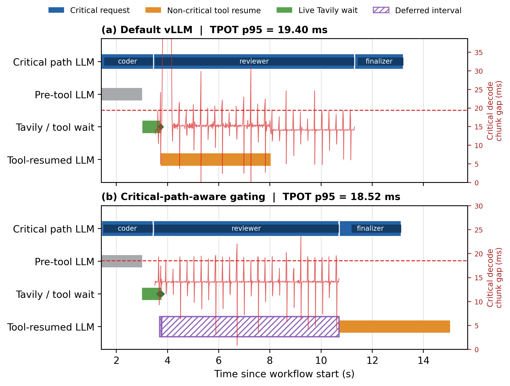
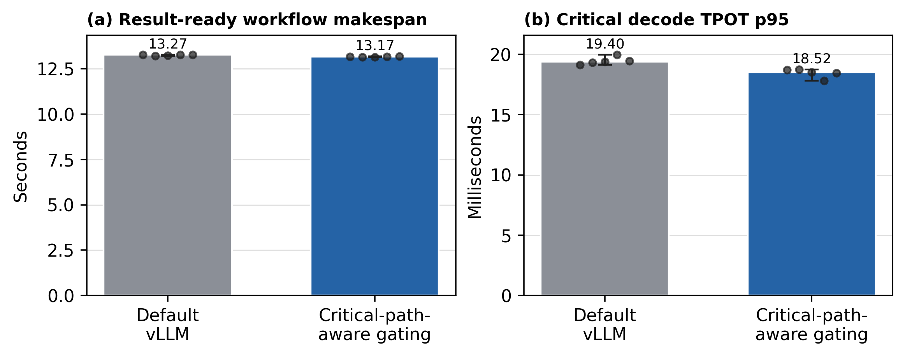

# Week 6: Real-execution trace-guided case study

## Scope and claim

This case study does not propose a new serving scheduler and does not claim superiority over AgentServe or other serving systems. It tests one narrower claim:

> MASBench profiling exposes graph-dependent tool-return interference, and the exposed graph/criticality/resume metadata is sufficient to drive a simple online admission decision that protects critical decode.

The primary experiment is a single top-level `tool_resume_contention_meso` workflow. Internal agent requests and tool branches execute concurrently, but independent user workflows are never co-scheduled. All primary runs use real Qwen3.5-4B execution through a local vLLM OpenAI-compatible streaming endpoint and live Tavily search. Synthetic or recorded tool results are not used.

## Distinction from the earlier replay PoC

The earlier source-trace/deterministic-replay path is retained for controlled architecture exploration, but it is not evidence for this case study. The present evidence path is:

`real workflow -> online dependencies -> real vLLM requests + live Tavily calls -> online trace collection -> post-run analysis`

The admission controller does not read a completed trace, predict arrivals or output length, or use the post-hoc actual critical path. It receives only the ready request's node/agent identity, dependency-derived metadata, static critical-path-candidate flag, tool-resume flag, and the current first-token-to-completion state of critical requests.

## Runtime and policy

The controlled workload uses four non-critical branches with the lifecycle `pre-tool LLM -> live Tavily search -> resumed LLM`. The critical branch is `critical coder -> critical reviewer -> finalizer`. Output budgets shape a repeatable controlled workload; they are not inputs to the admission policy.

The compared settings are:

1. **Default vLLM.** Every dependency-ready request is immediately submitted.
2. **Critical-path-aware gating.** A critical request is always submitted immediately. A non-critical, tool-resumed request that becomes ready while any critical request is in observed active decode is held until that decode completes or the 30-second maximum defer expires.

The implementation records `llm_request_ready`, `admission_decision`, optional `admission_defer_start/end`, request submission, first SSE token/chunk, completion, token usage, tool call/return, and graph metadata. Critical decode state begins only on the streaming first-token callback—not at request submission.

## Controlled workload results

Five runs per setting were collected. Every run passed two validity checks: all LLM requests reported `openai_sse_chunk` timing, and every search event reported `tool_mode=live` with provider `tavily`. The API key is present only in the ignored local `.env`; a repository trace/log scan found no key.

| Metric (median; min–max) | Default vLLM | Critical-path-aware | Effect |
|---|---:|---:|---:|
| Tool-resume overlaps in reviewer decode | 4 (4–4) | 0 (0–0) | eliminated in 5/5 runs |
| Critical decode TPOT | 15.263 ms (15.237–15.291) | 14.102 ms (14.090–14.135) | -7.6% |
| Critical decode TPOT p95 | 19.404 ms (19.142–19.969) | 18.522 ms (17.826–18.737) | -4.5% |
| Critical reviewer decode duration | 7.800 s (7.787–7.815) | 7.207 s (7.201–7.224) | -7.6% |
| Critical TTFT | 47.48 ms (46.85–52.83) | 47.42 ms (45.72–50.28) | approximately unchanged |
| Result-ready workflow makespan | 13.265 s (13.207–13.274) | 13.170 s (13.144–13.194) | -0.7% |
| Full trace/background-drain completion | 15.250 s (15.186–15.285) | 17.075 s (17.049–17.097) | +12.0% |
| Deferred resumes | 0 | 4 (4–4) | all released |
| Maximum per-request defer | 0 | 7.014 s (7.006–7.036) | below 30 s bound |
| Per-run median Tavily latency | 0.708 s (0.672–0.776) | 0.676 s (0.674–0.742) | recorded separately |

The result-ready makespan is the finalizer completion time: the workflow can return its critical result at that point. The later `workflow_end` additionally waits for explicitly non-blocking late-evidence merge/drain work so that its trace is complete. Gating modestly improves result readiness and materially stabilizes the critical decode, but delays non-critical drain. This is the expected trade-off of the intentionally simple policy and should not be described as an unconditional throughput improvement.

No request starved: all 20 deferred requests across the five gated runs were admitted after the critical decode, with a median per-run maximum defer of 7.014 seconds, well below the 30-second safety bound.

## Figures

Figure 1 uses the median-TPOT-p95 run from each setting. The green spans and diamonds are measured Tavily call/return times; orange spans are the four resumed LLM executions; purple hatching is the online defer interval. The red signal is the critical reviewer's observed SSE chunk gap, with its per-run p95 shown by the dashed line. In the baseline, tool returns release four resume requests into the reviewer decode. Under gating, the same requests remain client-side until reviewer decode completes.

Figure 2 reports all five runs. Bars are medians, black dots are individual runs, and error bars show min–max variation. The makespan panel uses result-ready time; background-drain completion is reported in the table rather than hidden.

## Full-workflow validation

`issue_to_verified_patch` was executed for the fixed SWE-bench Lite task `astropy__astropy-12907` under both policies. Each run issued 14 real vLLM streaming requests and two live Tavily searches. The current full-workflow stage order did not produce an eligible non-critical tool-resume request during an active critical decode, so no request was gated and no benefit is attributed:

| Setting | Makespan | Median Tavily latency | Eligible/deferred resumes |
|---|---:|---:|---:|
| Default vLLM | 25.885 s | 4.900 s | 0 / 0 |
| Critical-path-aware | 23.836 s | 2.464 s | 0 / 0 |

The full-workflow latency difference tracks external Tavily variation and is therefore excluded from Figure 2. This negative result is useful: graph-aware gating is conditional on the profiled interference motif and is not expected to change workflows that do not expose that online window.

## Observation boundary and limitations

- First token, completion, and chunk gaps are observed at the OpenAI-compatible HTTP SSE client. Aggregate TPOT uses vLLM completion-token usage; TPOT p95 is the p95 SSE chunk inter-arrival gap.
- Request overlap is reconstructed from real submit/first-token/completion lifecycles and tool-return provenance. It is a serving-level overlap observation, not proof of CUDA kernel-level prefill/decode overlap.
- vLLM `/metrics` samples are retained in the raw JSONL traces. The installed vLLM build warns that the repository-specific `VLLM_MAS_TRACE_PATH` variable is unknown, so no unsupported per-kernel or per-batch claim is made.
- The controlled result is five repetitions on one model/GPU configuration. It establishes the evidence chain for the case study, not broad scheduler generality.

## Artifacts

- `experiment_config.json`: secret-free runtime and workload configuration.
- `week6_real_case_study_runs.csv`: per-run metrics and validity flags.
- `week6_real_case_study_summary.json`: medians, variation, effects, and source trace paths.
- `week6_full_workflow_validation.json`: fixed-task validation and attribution guardrail.
- `raw_traces/`: 10 controlled and 2 full-workflow canonical real-execution JSONL traces.
- `figure1_real_execution_interference_timeline.png` and `figure2_end_to_end_benefit.png`: the only two primary paper figures.
